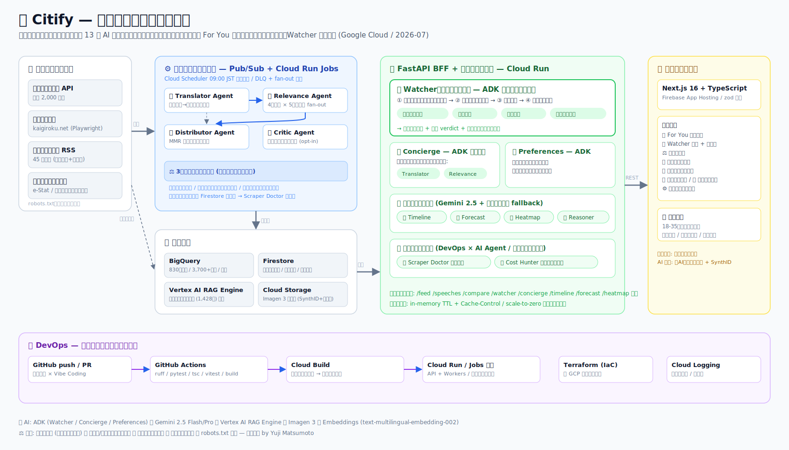
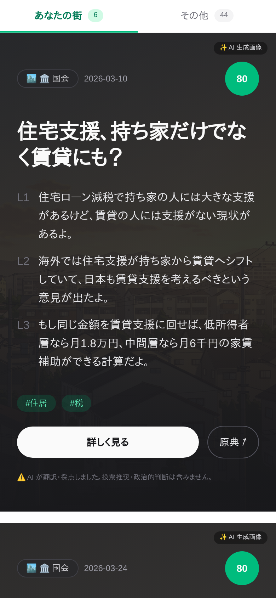
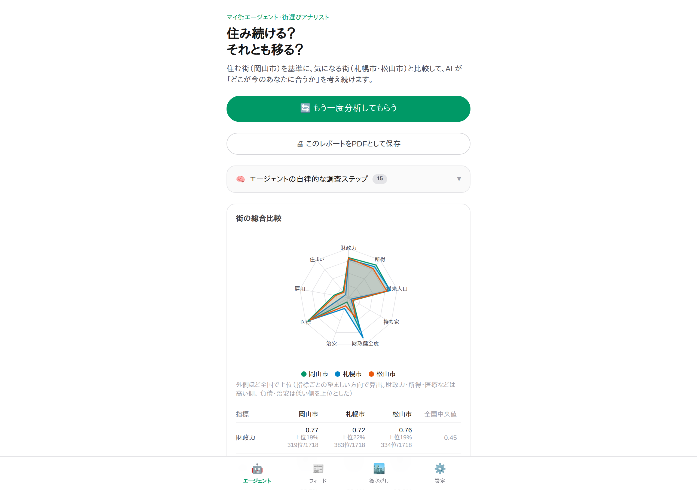
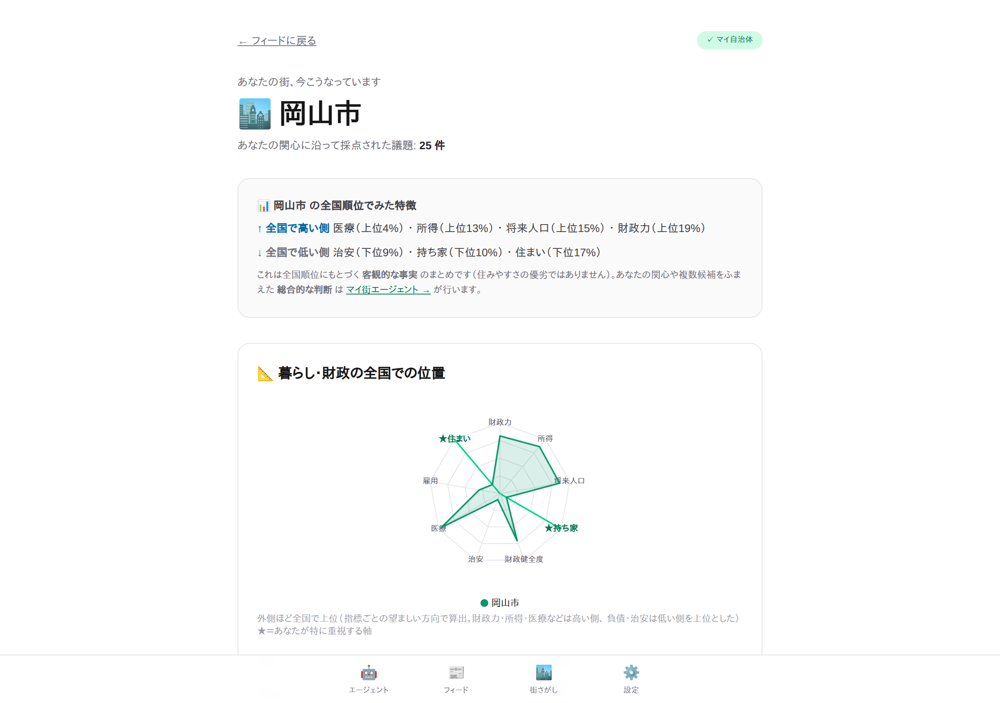

# 🏛️ Citify

> **自分の街、自分の世代の話を、60 秒で。**

Citify は、自治体の議事録・プレスリリース・統計を AI が読み、役所言葉を若者の言葉に翻訳して TikTok 風の縦スクロールフィード(テキスト + AI 生成サムネ)で届ける **マルチエージェント AI プロダクト** です。「街の見張り番」**Watcher エージェント**が自分で調査計画を立て、統計・議題・人口推移を並列調査して「あなたに合う街」を自己検証つきで結論します。

自治体ホームページは「図書館」(整然と並んでいるが自分で探しに行く必要がある)。Citify は「For You フィード」(関心軸でキュレーションされ、向こうから流れてくる)。

| | |
|---|---|
| 🌐 **デモ (デプロイ済み)** | https://citify-web--citify-dev.asia-east1.hosted.app/ |
| 🏆 **ハッカソン** | [Findy DevOps × AI Agent Hackathon 2026](https://findy.notion.site/devops-ai-agent-hackathon-2026) (提出 2026-07-10) |
| 👤 **開発** | Yuji Matsumoto (個人開発 / Vibe Coding) |

---

## 🏗️ アーキテクチャ



全国 **1,795 自治体マスタ**のうち **830 自治体・議会が稼働中** (`apps/web/public/municipalities.json` の `is_active`)、**4,500 件超の議題**を処理 (2026-07 時点の BigQuery `scored_speeches_latest` で distinct speech_id = 4,553)。図は上の SVG が正、コンポーネント補足は [docs/ARCHITECTURE.md](./docs/ARCHITECTURE.md) (一部は初期設計時の記述・Veo 等は未使用)。

---

## ✨ 主な機能

| 画面 | 内容 |
|---|---|
| 📰 **For You フィード** | 議事録・プレスを年代×関心×地理で採点し縦スクロール配信。Imagen サムネ + 3 行サマリ |
| 🔭 **Watcher (街の見張り番)** | ADK 自律エージェント。調査計画→ツール並列実行→自己検証→根拠つき結論 + アクションプラン |
| ⚖️ **自治体比較** | 2〜3 自治体 × テーマの横並び比較 + AI の中立観察 |
| 💬 **コンシェルジュ** | 対話で街探し。4 つの BQ ツールを自律選択する ADK ツールループ (翻訳/影響度を sub_agents に構成) |
| 🏙️ **街ダッシュボード** | 全国順位・人口推移 (実績+推計)・年齢構成・関心軸別議題 |
| 🗾 **全国ヒートマップ / 🕰 タイムライン** | Agent が指標を自動選定する 47 都道府県比較 / 議論の時系列ナラティブ |
| 🛠️ **運用SREクルー (`/ops`)** | Scraper Doctor + Cost Hunter + データ鮮度を統括する自律クルー。Watcher と同型の「計画→並列専門家→批判→人間ゲート」を**自分たちの運用**に適用 (DevOps × AI Agent)。自動実行はせず提案まで |

### スクリーンショット

| For You フィード | Watcher | 街ダッシュボード |
|---|---|---|
|  |  |  |

---

## 🤖 13 の AI エージェント

| 系統 | Agent | 役割 |
|---|---|---|
| パイプライン (Pub/Sub + Cloud Run Jobs) | 🖊️ Translator | 役所言葉→年代別に平易化 (Gemini 2.5 Flash) |
| | 🎯 Relevance | 4 軸採点 × 5 ペルソナ fan-out |
| | 📮 Distributor | MMR 多様性ランキング (非 LLM・設計判断) |
| | 🧪 Critic | 翻訳品質の自己批評ループ (`CITIFY_ENABLE_CRITIQUE=1` で opt-in) |
| ADK (自律・対話) | 🔭 Watcher | 自律ツールループ + 並列専門家 + 自己検証。本作のヒーロー |
| | 💬 Concierge | 4 つの BQ ツールを自律選択する **ADK ツールループ** (`CITIFY_CONCIERGE_ADK=1` で本番・sync fallback 付き)。translator/relevance を sub_agents に構成 |
| | 📝 Preferences | 自然言語の自己紹介から関心軸を構造化抽出 |
| 分析 API | 🕰 Timeline / 📈 Forecast / 🗾 Heatmap Advisor / 🔍 Reasoner | 時系列ナラティブ / 件数予測 / 指標自動選定 / 説明の平易化 (全てルールベース fallback 付き) |
| 運用 (DevOps × AI Agent) | 🩺 Scraper Doctor / 💰 Cost Hunter | 失敗診断・修正提案 / コスト異常検知・削減提案 (自動実行なし)。運用SREクルー `/ops` の専門家として合成 |

### 🧠 本物のマルチエージェント = 審査基準① の中核

同一の自律パターン **「計画 → 並列専門家 → 批判 (Critic/悪魔の代弁者) → 人間ゲート・自動実行なし」** を、対象を変えて **2 ドメイン**で実証しています:

1. **Watcher** (街選び) — プランナーが調査計画を立て、4 専門家 (人口/財政/暮らし・安全/議題) を並列実行、Critic と悪魔の代弁者が検証、倫理ゲートを通過。
2. **Ops crew** (`/ops`, 自分たちの運用) — 同じパターンをスクレイパー健全性・コスト・データ鮮度の診断に適用。**「なぜ多エージェントか」と「なぜ DevOps か」が 1 つの答えに収束**。

加えて **Concierge** (対話での街探し) は、4 つの BQ ツールを自律選択する **ADK ツールループ・エージェント**です (translator/relevance を sub_agents に構成)。

決定論で十分な部分 (Distributor=MMR, Forecast=回帰) は LLM を使わない設計判断であり、水増しではなく適材適所です。

---

## 📥 データソース (すべて公開データ)

- 国会会議録 検索 API (国立国会図書館) — 発言 2,000 件超を取得、うち **1,428 件を RAG コーパス化**
- 自治体議事録 (kaigiroku.net / Playwright)
- 自治体プレスリリース RSS (都道府県 + 政令市 + 中核市を対象。実運用で巡回中は **45 自治体** / `infra/seed/tier1_supplements.csv`)
- e-Stat 国勢調査 / 不動産情報ライブラリ (Reinfolib) — 統計・人口推移

> DB-Search 系 (150+ 自治体) は robots.txt が議事録パスを全面 Disallow のため**対応コードごと Drop** しました (倫理方針: robots.txt 尊重)。

---

## 🛠️ 技術スタック

| 層 | 技術 |
|---|---|
| AI | **ADK** (Watcher/Concierge/Preferences) / **Gemini 2.5 Pro・Flash** / **Vertex AI RAG Engine** / **Imagen 3** / Embeddings (text-multilingual-embedding-002) |
| バックエンド | Python 3.12 / FastAPI / Cloud Run + Cloud Run Jobs / Pub/Sub (4 段パイプライン + DLQ) |
| データ | BigQuery / Firestore / Cloud Storage |
| フロントエンド | Next.js 16 (App Router) + TypeScript / Tailwind CSS / zod / Firebase App Hosting |
| DevOps | Terraform (全リソース IaC + **監視アラートポリシー**: Cloud Run 5xx/p95・Pub/Sub DLQ) / GitHub Actions (ruff・pytest・tsc・vitest・build・**gitleaks**) / Cloud Build (パスベース検知→自動デプロイ) / Cloud Scheduler / Cloud Logging |
| 認証・冪等性 | Firebase 認証 (ID トークン検証、`CITIFY_AUTH_MODE=firebase` で段階導入・IDOR 解消) / BigQuery MERGE upsert 冪等化 (`CITIFY_BQ_MERGE=1`) |

---

## 🚀 セットアップ

### 前提条件
- **開発環境**: Linux / macOS / **WSL2 (Ubuntu 24.04 推奨、Windows ユーザー向け)**
- Node.js 20+ / Python 3.12+ / Google Cloud SDK / Terraform 1.7+

> Windows ユーザーの方は、WSL2 + VSCode Remote 環境での開発を推奨しています。詳細は [docs/GETTING_STARTED.md](./docs/GETTING_STARTED.md) を参照。

### 1. リポジトリのクローン

```bash
git clone https://github.com/yujmatsu/citify.git
cd citify
```

### 2. 環境変数の設定

```bash
cp .env.example .env.local
# .env.local を編集して値を設定
```

### 3. GCP プロジェクトの準備

```bash
gcloud config set project citify-dev
gcloud auth application-default login
gcloud auth application-default set-quota-project citify-dev
gcloud services enable \
  run.googleapis.com \
  cloudbuild.googleapis.com \
  artifactregistry.googleapis.com \
  aiplatform.googleapis.com \
  firestore.googleapis.com \
  bigquery.googleapis.com \
  storage.googleapis.com \
  pubsub.googleapis.com \
  cloudscheduler.googleapis.com \
  secretmanager.googleapis.com \
  logging.googleapis.com \
  cloudtrace.googleapis.com \
  iamcredentials.googleapis.com
```

### 4. インフラ構築 (Terraform)

```bash
cd infra/env/dev
terraform init
terraform plan
terraform apply
```

### 5. バックエンド起動

```bash
cd apps/api
python3 -m venv .venv && source .venv/bin/activate
pip install -e .
uvicorn main:app --reload
```

### 6. フロントエンド起動

```bash
cd apps/web
npm install
npm run dev
```

ブラウザで `http://localhost:3000` を開く。

---

## 📁 ディレクトリ構成

```
citify/
├── README.md           # このファイル (公開フェイス)
├── CLAUDE.md           # Claude Code が自動読込
├── AGENTS.md           # 他のAIコーディングエージェント向け
│
├── docs/               # 設計ドキュメント集
│   ├── PROJECT.md           # プロダクト概要 (北極星)
│   ├── FEATURES.md          # 機能仕様
│   ├── ARCHITECTURE.md      # アーキテクチャ詳細
│   ├── DEMO_SCRIPT.md       # デモ動画スクリプト
│   ├── assets/              # アーキテクチャ図 (SVG/PNG)
│   └── submission/          # ProtoPedia 提出素材 + スクリーンショット
│
├── apps/
│   ├── web/            # Next.js フロントエンド (16 画面)
│   ├── api/            # FastAPI BFF (Cloud Run)
│   └── workers/        # Cloud Run Jobs (Pub/Sub workers)
│
├── agents/             # 13 AI エージェント
│   ├── translator/ relevance/ distributor/ critic/     # パイプライン
│   ├── watcher/ concierge/ preferences/                # ADK (自律・対話)
│   ├── timeline/ forecast/ heatmap_advisor/ reasoner/  # 分析 API
│   ├── scraper_doctor/ cost_hunter/                    # 運用
│   └── _shared/                                        # 共通倫理ガードレール
│
├── scrapers/           # データ収集
│   ├── kokkai/             # 国会会議録 API (JSON)
│   ├── kaigiroku_net/      # DiscussNet SPA (Playwright)
│   ├── press_rss/          # プレスリリース RSS (45 自治体)
│   ├── reinfolib/          # 不動産情報ライブラリ (統計・人口)
│   └── voices_asp/         # VOICES (robots.txt 制約で limited scope)
│
├── infra/              # Terraform IaC + seed データ
├── scripts/            # 運用スクリプト
└── .github/workflows/  # GitHub Actions
```

---

## 🧪 テスト

```bash
# Python (700+ tests)
apps/api/.venv/bin/python -m pytest

# TypeScript
cd apps/web
npx vitest run
npx tsc --noEmit
```

---

## 🚢 デプロイ

```bash
# main にマージで自動デプロイ (Cloud Build: API / Firebase App Hosting: web)
git push origin main

# workers (Cloud Run Jobs) は手動トリガー
gcloud builds submit --config cloudbuild-workers.yaml
```

---

## 🔒 倫理・コンプライアンス

Citify は以下を厳守します:

- **政治的中立性**: 特定政党・候補者の推奨は一切しません。賛否も出しません (多層ガードレール + 失敗時ルールベース代替)
- **AI 生成コンテンツの明示**: すべての画像に SynthID + 「AI 生成」ラベル付与
- **政治家描写の禁止**: 実在の政治家・首長・議員の顔・声・名前を含む生成はしません (`person_generation="dont_allow"`)
- **議事録の引用**: 全文転載せず、要約 + 原典 URL の形式
- **robots.txt の尊重**: Disallow のソースは対応コードごと Drop
- **個人情報の最小化**: リアクションは集計後匿名化

詳細は [docs/PROJECT.md](./docs/PROJECT.md) の倫理セクション参照。

---

## 🛡️ セキュリティ・堅牢性

提出前に自己コードレビュー(critique-loop)のパスを回し、見つけた問題を修正しました:

- **CORS 資格情報反射の脆弱性を発見・修正**: `allow_origins="*"` + `allow_credentials=True` は Origin を反射し任意サイトから資格情報付きで叩けるアンチパターン(CWE-942)。web ドメイン限定 + credentials off に修正
- **レート制限**: 高コストな LLM/エージェント endpoint(`/v1/concierge`・`/v1/watcher/*/run`)に user 単位のスライディングウィンドウ制限を追加(無認証コスト暴走の緩和)
- **倫理フィルタの全生成エージェント配線**: 政党名・氏名+役職の leak 検出を translator / relevance / concierge / watcher に集約配線(自己申告 boolean に依存しない独立検出)
- **エージェントの堅牢性**: 全 LLM エージェントに rule-based fallback / leak 検出 / graceful degrade。Watcher は暴走ツール呼び出しの停止・引用 speech_id の接地(実在ID照合)・verdict 温度固定
- **CI ゲート**: ruff(lint+format)/ pytest / tsc / vitest / next build / terraform fmt に加え **gitleaks の全履歴シークレットスキャン**
- **既知の残課題(提出後)**: 本人確認を伴う認証は現状デモ用の簡易方式。真の認証(Firebase Auth)・BQ MERGE 冪等化・配信時パーソナライズは提出後対応として設計済み

---

## 📚 ドキュメント

### ルート (AI 開発エージェント向け)
| ドキュメント | 内容 |
|---|---|
| [CLAUDE.md](./CLAUDE.md) | Claude Code 向け開発ガイド |
| [AGENTS.md](./AGENTS.md) | 他の AI コーディングエージェント向け指示 |

### 設計ドキュメント (`docs/`)
| ドキュメント | 内容 |
|---|---|
| [PROJECT.md](./docs/PROJECT.md) | 北極星：プロダクトビジョン、倫理制約 |
| [FEATURES.md](./docs/FEATURES.md) | 機能仕様 (Must/Should/Could/Won't) |
| [ARCHITECTURE.md](./docs/ARCHITECTURE.md) | アーキテクチャ補足 (1 枚図は上の SVG が正。本文の一部は初期設計時の記述で Veo 等は未使用) |
| [DATA_SOURCES.md](./docs/DATA_SOURCES.md) | データソース仕様 |
| [DATA_MODEL.md](./docs/DATA_MODEL.md) | Firestore/BigQuery スキーマ |
| [DEMO_SCRIPT.md](./docs/DEMO_SCRIPT.md) | デモ動画・ピッチスクリプト |
| [TERRAFORM_GUIDE.md](./docs/TERRAFORM_GUIDE.md) | Terraform 初期化・運用ガイド |
| [GETTING_STARTED.md](./docs/GETTING_STARTED.md) | 開発開始ガイド |

---

## 🤝 コントリビューション

本リポジトリはハッカソン応募作品です。コントリビューションは現在受け付けていませんが、コメント・フィードバックは Issue で歓迎します。

---

## 📄 ライセンス

MIT License (詳細は [LICENSE](./LICENSE) 参照)

---

## 🙏 謝辞

- **データ提供**:
  - 国立国会図書館 (国会会議録 検索API)
  - 各自治体 (議事録・プレスリリース)
  - NTT-AT (kaigiroku.net)
  - 政府統計の総合窓口 e-Stat / 国土交通省 不動産情報ライブラリ
- **技術提供**:
  - Google Cloud (Vertex AI, Gemini, Imagen, ADK)
  - Firebase
- **ハッカソン主催**:
  - Findy 株式会社
  - グーグル・クラウド・ジャパン合同会社

---

## 📬 お問い合わせ

- 開発者: Yuji Matsumoto
- GitHub Issues: [issues](https://github.com/yujmatsu/citify/issues)

---

**「自分の街、自分の世代の話を、60 秒で。」**

Citify が、若者と自治体の距離を縮めるきっかけになれたら嬉しいです。
