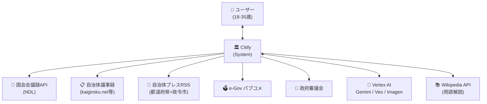
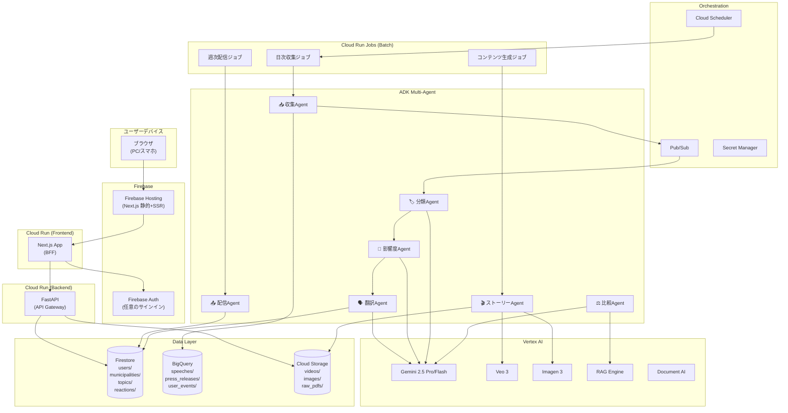
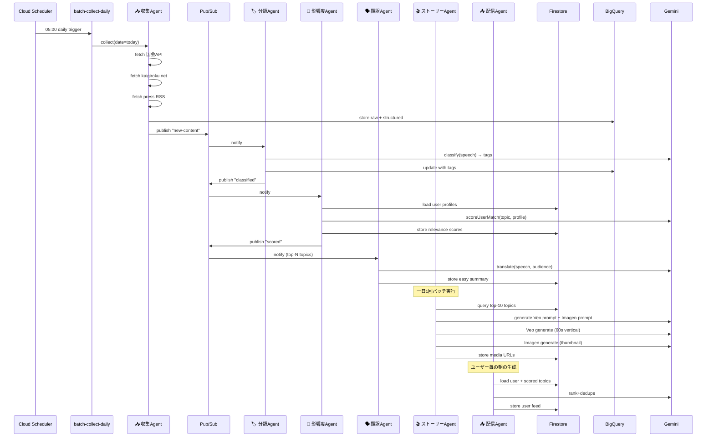
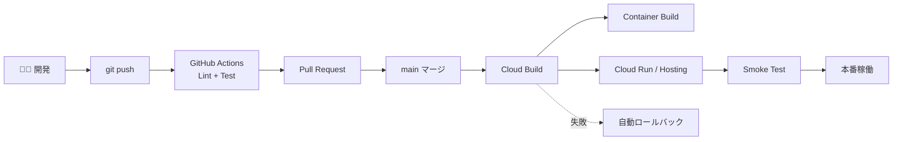

# ARCHITECTURE.md — システムアーキテクチャ詳細

> Citify の全体アーキテクチャ仕様書。コンポーネント、データフロー、エージェント連携、DevOpsパイプライン、観測性、セキュリティを網羅します。
>
> Coding Agent は新規コンポーネント実装前に必ずこのファイルを参照してください。

---

## 1. 設計原則

1. **Cloud Run 中心の Serverless First** — スケール 0 でコスト最小、必要時に自動拡張
2. **エージェントは疎結合**（Pub/Sub）— 1体壊れても全体が止まらない
3. **データは Firestore（運用）+ BigQuery（分析）の二層** — Firestore で UI、BigQuery で集計・RAG前処理
4. **すべて Terraform で管理** — 環境差分は変数で表現、dev/prod 切替が一発
5. **CI/CD は GitHub Actions + Cloud Build** — main マージで自動デプロイ
6. **観測性ファースト** — 全リクエストに correlation_id、構造化ログ
7. **「壊しても安全」** — 政治家描写など倫理違反はプロンプトレベルとフィルタの二段防御

---

## 2. C4 モデル — Level 1: System Context



### 外部システム一覧

| 名前 | 種別 | 提供 | 用途 | 認証 |
|---|---|---|---|---|
| 国会会議録 検索API | 公開API | 国立国会図書館 | 国会発言取得 | 不要 |
| kaigiroku.net (DiscussNetPremium) | Web | NTT-AT | 自治体議事録 | 不要 (要規約遵守) |
| DB-Search | Web | 大和速記 | 自治体議事録 | 不要 (要規約遵守) |
| 自治体プレスRSS | RSS | 各自治体 | プレスリリース | 不要 |
| e-Gov パブコメ | Web | 総務省 | 意見公募中の案件 | 不要 |
| Vertex AI / Gemini | Cloud API | Google | LLM推論・RAG | サービスアカウント |
| Veo 3 / Imagen 3 | Cloud API | Google | 動画・画像生成 | サービスアカウント |
| Wikipedia API | 公開API | Wikimedia | 用語解説 | 不要 |

---

## 3. C4 モデル — Level 2: Container



### コンテナ一覧

| コンテナ | 種別 | 役割 | 主要技術 |
|---|---|---|---|
| `web` | Next.js | フロントエンド + BFF | Next.js 15 (App Router), TypeScript, Tailwind, shadcn/ui |
| `api` | Cloud Run | REST API Gateway | FastAPI, Python 3.12, pydantic |
| `agent-collector` | Cloud Run | 議事録・プレス収集 | Python + scrapy系 + httpx |
| `agent-classifier` | Cloud Run | 議題テーマ分類 | ADK + Gemini Flash |
| `agent-relevance` | Cloud Run | 影響度スコアリング | ADK + Gemini Flash |
| `agent-translator` | Cloud Run | 役所言葉→平易化 | ADK + Gemini Pro |
| `agent-comparator` | Cloud Run | 自治体比較 | ADK + Gemini Pro + RAG |
| `agent-storyteller` | Cloud Run | Veo/Imagen 統括 | ADK + Veo 3 + Imagen 3 |
| `agent-distributor` | Cloud Run | 配信優先順位生成 | ADK + Gemini Flash |
| `batch-collect-daily` | Cloud Run Jobs | 毎日朝5時収集 | Python |
| `batch-generate` | Cloud Run Jobs | 動画・画像生成 | Python |
| `batch-notify-weekly` | Cloud Run Jobs | 月曜9時通知 | Python |

---

## 4. C4 モデル — Level 3: マルチエージェント詳細



### 7体のエージェント責務

| Agent | トリガ | 入力 | 出力 | 利用LLM |
|---|---|---|---|---|
| **収集 Collector** | 日次バッチ | 自治体マスタ・期間 | 生データを BigQuery へ | なし (Pythonのみ) |
| **分類 Classifier** | Pub/Sub「new-content」 | 発言テキスト | タグ・テーマ | Gemini Flash |
| **影響度 Relevance** | Pub/Sub「classified」 | タグ・ユーザープロファイル | スコア(0-100)+理由 | Gemini Flash |
| **翻訳 Translator** | 影響度上位のみ | 役所言葉文 | 3行サマリ・若者向け | Gemini Pro |
| **比較 Comparator** | API同期呼び出し | 2-3自治体+テーマ | 差分表 | Gemini Pro + RAG |
| **ストーリー Storyteller** | 日次バッチ | 上位議題 | Veo動画+Imagenサムネ | Veo 3 + Imagen 3 |
| **配信 Distributor** | ユーザー毎・要求時 | スコア済み議題群 | 優先順位ソート済リスト | Gemini Flash |

### 4.x ADK Wrapper Layer (Plan C 実装済)

Translator / Relevance / Distributor の 3 agent に **ADK (Agent Development Kit) wrapper** を追加実装済 ([agents/{name}/adk_agent.py](../agents/)):

```
┌─────────────────────────────────────────────────┐
│ ADK Agent Layer (E: Concierge から subcall 用)   │
│   ┌─────────────────┐  ┌─────────────────┐      │
│   │ ADKTranslator   │  │ ADKRelevance    │  ... │
│   │ .as_tool()      │  │ .as_tools()     │      │
│   │ .as_agent()     │  │ .as_agent()     │      │
│   └────────┬────────┘  └────────┬────────┘      │
└─────────────┼─────────────────────┼──────────────┘
              │ delegates to        │
┌─────────────▼─────────────────────▼──────────────┐
│ Existing Core Logic (変更なし、98 tests 全 pass) │
│   TranslatorAgent.translate()                    │
│   RelevanceAgent.score() / score_multi()         │
│   DistributorAgent.generate_feed()               │
│   ↓ Vertex AI (google.genai SDK 直叩き)          │
│   Gemini 2.5 Flash (Translator/Relevance)        │
└──────────────────────────────────────────────────┘
```

設計判断:
- 既存 core logic はそのまま保持 (薄い wrapper パターン)
- ADK は **lazy import** (`as_tool()` 内で `from google.adk.tools import FunctionTool`)
  → ADK 未 install 環境でも `adk_agent.py` の import 自体は成功
- `as_tool()`: 他 Agent (E: Concierge 等) から subcall 用の FunctionTool
- `as_agent()`: 単独 Agent (Runner で実行可能、demo 用)
- 串刺し demo: [agents/demo_adk_chain.py](../agents/demo_adk_chain.py)
  (`python -m agents.demo_adk_chain` で 5 ペルソナ × 3 段 chain 実行可能)

worker.py (Pub/Sub subscriber) は引き続き既存 core logic を使用、Cloud Run Job image の rebuild なしで Plan C を導入できた。

### 4.y Migration Concierge Agent (Plan E 実装済)

Plan E で **街診断 Migration Concierge Agent** を追加。Plan C で築いた ADK wrapper を **sub-agents として活用** し、ハッカソン審査基準①「マルチエージェント必然性」を本物の親子階層で実装。

```
┌─────────────────────────────────────────────────────────┐
│ 🟣 Concierge Agent (Plan E、ADK 親 Agent)               │
│   POST /v1/concierge endpoint で受信、対話応答を返す    │
│                                                          │
│   tools=[ search_municipalities,                         │
│           compare_municipalities,                        │
│           fetch_city_dashboard,                          │
│           fetch_city_speeches ]                          │
│                                                          │
│   sub_agents=[ ADKTranslatorAgent.as_agent(),            │
│                ADKRelevanceAgent.as_agent() ]            │
└────────────────────┬────────────────────────────────────┘
                     │ orchestrate via
                     ▼
┌─────────────────────────────────────────────────────────┐
│ GenaiConciergeRunner (agents/concierge/runner.py)        │
│   google.genai function calling で 4 tool を反復実行     │
│   (ADK Runner ではなく Plan C 実証済の genai 直叩き)     │
└────────────────────┬────────────────────────────────────┘
                     │ tool 呼び出し
                     ▼
┌─────────────────────────────────────────────────────────┐
│ Concierge tool 群 (agents/concierge/tools.py)            │
│   - search_municipalities: BQ municipality_stats から    │
│     match_score 計算 + TOP N 抽出                         │
│     (interests hit × constraint pass × growth bonus)     │
│   - compare_municipalities: 複数自治体の同 interest 議題 │
│     を BQ scored_speeches_latest から横並びで取得          │
│   - fetch_city_dashboard: stats + 関心軸別議題数         │
│   - fetch_city_speeches: relevance 順上位議題            │
└─────────────────────────────────────────────────────────┘
```

倫理ガード:
- `agents/_shared/forbidden.py` に FORBIDDEN_PATTERNS を集約 (translator / relevance / concierge 3 agent から import)
- Concierge reply に post-validation、違反検出時は安全な reply に差し替え

Demo スクリプト:
- `agents/demo_concierge.py`: 3 persona fixture (26 歳子育て / 介護 34 歳 / ワーママ 30 歳)
- `python -m agents.demo_concierge --persona 2 --live` で live LLM 経由動作

Frontend chat UI:
- `apps/web/src/app/concierge/page.tsx`
- Markdown rendering (`react-markdown`) + 候補 cards + tool_calls 折りたたみ
- 「街ダッシュボードを見る」で既存 `/cities/{code}` ページへ遷移

---

## 5. データフロー

### 5.1 朝のバッチ処理（毎日 05:00）

```
[05:00 Cloud Scheduler]
        ↓
[batch-collect-daily (Cloud Run Job)]
        ├→ 国会API: 直近24h発言取得
        ├→ kaigiroku.net: tier1自治体の新着議事録
        └→ プレスRSS: 47都道府県+政令市
        ↓
[BigQuery: speeches/press_releases]
        ↓ Pub/Sub
[Classifier → Relevance → Translator] (並列処理)
        ↓
[Firestore: topics/{topicId}]
        ↓
[batch-generate (Cloud Run Job)]
        ├→ Veo: 動画生成 (上位N議題のみ)
        └→ Imagen: サムネ生成 (全議題)
        ↓
[Cloud Storage: videos/, images/]
        ↓ URL を Firestore に書き戻し
[Firestore: topics/{topicId}.mediaUrls]
```

### 5.2 ユーザーがアプリを開いた時（リアルタイム）

```
User → web (Next.js) → api (FastAPI)
                          ↓
                    Firestore: users/{uid}
                          ↓
                    Distributor Agent
                          ├→ Firestore: topics (relevance score でフィルタ)
                          └→ Gemini Flash: 最終ランキング
                          ↓
                    Firestore: userFeeds/{uid}
                          ↓
                    web に JSON返却
                          ↓
                    For You フィード描画
```

### 5.3 リアクション・「気になる」のフロー

```
User: 「気になる」タップ
   ↓
web → api: POST /topics/{id}/reactions
   ↓
Firestore: reactions/{topicId-uid} 追加
BigQuery: user_events ストリーミング挿入
   ↓
Cloud Run Job (1時間ごと):
   - reactions を集計
   - Firestore: topics/{id}.aggregations 更新
```

### 5.4 比較ビュー（同期処理）

```
User: 自治体A、自治体B を選択、テーマ「子育て支援」
   ↓
web → api: POST /compare
   ↓
Comparator Agent
   ├→ Vertex AI RAG: 関連議事録を抽出 (自治体A, B 各々)
   ├→ Gemini Pro: 「両者の制度を比較し、差分をJSONで」
   └→ Firestore: comparisons/{compId} に結果キャッシュ
   ↓
web: 比較画面描画
```

---

## 6. 議事録 RAG パイプライン

```
[議事録 (BigQuery)]
        ↓ 日次同期ジョブ
[Document Chunker]
   - 発言単位で分割
   - メタデータ: speaker, date, municipality, meeting_url
        ↓
[Vertex AI Embeddings]
   - gemini-embedding-001
        ↓
[Vertex AI Vector Search (RAG Engine)]
   index: citify-meetings
   メタデータでフィルタ可能 (自治体・日付・テーマ)
        ↓
各エージェントが検索 (Function Calling 経由)
```

### RAG クエリ例

```python
results = rag_engine.retrieve_contexts(
    rag_corpora=["citify-meetings"],
    query="若者向け家賃補助",
    similarity_top_k=5,
    filter={
        "municipality": "13112",  # 東京都世田谷区
        "date_from": "2026-01-01"
    }
)
```

---

## 7. DevOps パイプライン

### 7.1 CI/CD 全体図



### 7.2 GitHub Actions ワークフロー

**`.github/workflows/ci.yml`**

```yaml
name: CI
on:
  pull_request:
    branches: [main, develop]
  push:
    branches: [main, develop]

jobs:
  python:
    runs-on: ubuntu-latest
    steps:
      - uses: actions/checkout@v4
      - uses: actions/setup-python@v5
        with:
          python-version: '3.12'
      - run: pip install ruff pytest
      - run: ruff check .
      - run: ruff format --check .
      - run: pytest -x

  typescript:
    runs-on: ubuntu-latest
    defaults:
      run:
        working-directory: apps/web
    steps:
      - uses: actions/checkout@v4
      - uses: actions/setup-node@v4
        with:
          node-version: '20'
      - run: npm ci
      - run: npm run lint
      - run: npm run type-check

  terraform:
    runs-on: ubuntu-latest
    defaults:
      run:
        working-directory: infra
    steps:
      - uses: actions/checkout@v4
      - uses: hashicorp/setup-terraform@v3
      - run: terraform fmt -check -recursive
      - run: terraform validate
```

### 7.3 Cloud Build パイプライン

**`cloudbuild/api.yaml`**

```yaml
steps:
  - name: 'gcr.io/cloud-builders/docker'
    args: ['build', '-t', 'asia-northeast1-docker.pkg.dev/$PROJECT_ID/citify/api:$SHORT_SHA',
           '-f', 'apps/api/Dockerfile', '.']

  - name: 'gcr.io/cloud-builders/docker'
    args: ['push', 'asia-northeast1-docker.pkg.dev/$PROJECT_ID/citify/api:$SHORT_SHA']

  - name: 'gcr.io/google.com/cloudsdktool/cloud-sdk'
    entrypoint: gcloud
    args:
      - run
      - deploy
      - citify-api-${_ENV}
      - --image=asia-northeast1-docker.pkg.dev/$PROJECT_ID/citify/api:$SHORT_SHA
      - --region=asia-northeast1
      - --platform=managed
      - --service-account=citify-api-${_ENV}@$PROJECT_ID.iam.gserviceaccount.com

substitutions:
  _ENV: dev
```

### 7.4 パスベース変更検知（AIZAP方式）

`apps/api/**` の変更時のみ api をビルドする：

```yaml
- name: Detect changes
  id: changes
  uses: dorny/paths-filter@v3
  with:
    filters: |
      api:
        - 'apps/api/**'
      web:
        - 'apps/web/**'
      agents:
        - 'agents/**'
```

### 7.5 Terraform モジュール構成

```
infra/
├── modules/
│   ├── cloud_run_service/
│   ├── cloud_run_job/
│   ├── firestore/
│   ├── bigquery_dataset/
│   ├── pubsub_topic/
│   ├── cloud_scheduler/
│   ├── secret_manager/
│   ├── vector_search/
│   └── iam_service_account/
├── env/
│   ├── dev/
│   │   ├── main.tf
│   │   ├── variables.tf
│   │   └── terraform.tfvars
│   └── prod/
│       ├── main.tf
│       ├── variables.tf
│       └── terraform.tfvars
└── backend.tf       # GCS state
```

---

## 8. 観測性 (Observability)

### 8.1 ログ

すべてのサービスで構造化ログ (JSON)。

```python
# Python (FastAPI)
import logging
import json_log_formatter

formatter = json_log_formatter.JSONFormatter()
handler = logging.StreamHandler()
handler.setFormatter(formatter)
logger = logging.getLogger('citify')
logger.addHandler(handler)
logger.info('topic.translated', extra={
    'request_id': request_id,
    'topic_id': topic_id,
    'agent': 'translator',
    'gemini_model': 'gemini-2.5-pro',
    'latency_ms': 1234
})
```

### 8.2 トレース

OpenTelemetry → Cloud Trace。`X-Request-Id` ヘッダーで横断的に追跡。

### 8.3 メトリクス (Cloud Monitoring)

- リクエスト数 (per service)
- レスポンス時間 p50/p95/p99
- エラーレート
- Gemini API レイテンシ
- Veo/Imagen 生成成功率
- スクレイピング成功率 (per municipality)

### 8.4 アラート

| アラート | 条件 | 通知先 |
|---|---|---|
| API エラー率 > 5% | 5分間継続 | Slack/メール |
| スクレイピング失敗 > 10% | 1日 | メール (バッチ後) |
| Cloud Run コスト > $50/day | 日次 | メール |
| Veo 生成失敗 > 30% | 1時間 | Slack |

---

## 9. セキュリティ

### 9.1 認証・認可

```
ユーザー → Firebase Auth (Googleログイン / 匿名)
            ↓ ID Token
        Next.js (BFF)
            ↓ verify
        FastAPI (api-gateway)
            ↓ サービスアカウントトークン
        各 Agent / Vertex AI / Firestore
```

### 9.2 IAM ロール

| サービスアカウント | 主な権限 |
|---|---|
| `citify-api@` | Firestore RW, Pub/Sub Publish, Secret Manager Read |
| `citify-collector@` | BigQuery WriterUser, Cloud Storage Object Admin |
| `citify-storyteller@` | Vertex AI User, Cloud Storage Admin |
| `citify-batch@` | Cloud Run Invoker, BigQuery DataViewer |

### 9.3 シークレット管理

- Gemini API キー、外部サービストークン → Secret Manager
- Terraform 経由で IAM 付与、コードには記載しない
- ローカル開発: `.env.local`（Git除外）

### 9.4 個人情報の取り扱い

- ユーザー住所は **郵便番号レベルまで**（番地不要）
- 「気になる」リアクションは **集計後にuid破棄**
- BigQuery user_events は **30日でTTL**

### 9.5 倫理ガードレール（プロンプトインジェクション対策）

```python
# packages/safety/filters.py

POLITICAL_BIAS_PATTERNS = [
    r"投票を促す", r"○○党を支持", r"○○候補に投票",
    r"絶対に正しい", r"明らかに間違っている",
]

POLITICIAN_NAMES_BLOCKLIST = [...]  # 現職政治家名のリストを保持

def check_safety(text: str) -> tuple[bool, str | None]:
    for pattern in POLITICAL_BIAS_PATTERNS:
        if re.search(pattern, text):
            return False, f"political bias: {pattern}"
    for name in POLITICIAN_NAMES_BLOCKLIST:
        if name in text:
            return False, f"politician name detected: {name}"
    return True, None
```

---

## 10. パフォーマンス・スケーリング戦略

### 10.1 想定負荷（ハッカソン+本番想定）

- 同時アクセスユーザー: 100名 (本番想定)
- ピーク: 月曜 9:00（通知開封後10分）に 70% が開く

### 10.2 Cloud Run 設定

| サービス | min-instance | max-instance | concurrency |
|---|---|---|---|
| `web` | 0 | 10 | 80 |
| `api` | 0 | 10 | 50 |
| `agent-*` | 0 | 5 | 10 |
| `batch-*` | (Cloud Run Jobs) | 1 | — |

### 10.3 Firestore インデックス

| Collection | Field 1 | Field 2 | Order |
|---|---|---|---|
| topics | municipalityCode | publishedAt | DESC |
| topics | tags (array-contains) | publishedAt | DESC |
| userFeeds | uid | priority | DESC |
| reactions | topicId | createdAt | DESC |

### 10.4 BigQuery パーティション・クラスタリング

- `speeches` : PARTITION BY date, CLUSTER BY municipality_code
- `press_releases` : PARTITION BY published_date
- `user_events` : PARTITION BY event_date, CLUSTER BY uid

### 10.5 コスト最適化

| 項目 | 戦略 |
|---|---|
| Gemini Pro呼出 | 翻訳・比較のみ。分類・影響度は Flash |
| Veo生成 | 1日上位3議題のみ。残りは Imagen 静止画 |
| Imagen生成 | キャッシュキー (テーマ+トーン) で再利用 |
| Cloud Run | min-instance=0 |
| BigQuery | パーティション分割で読み取り最小化 |

---

## 11. Graceful Degradation

| 障害 | 対応 |
|---|---|
| 国会API がダウン | 直近キャッシュ提供、UI に「データ古い」表示 |
| kaigiroku.net がHTML構造変化 | 該当パーサーをスキップ、他自治体は継続 |
| Gemini API エラー | リトライ (exponential backoff)、3回失敗で議題スキップ |
| Veo 生成失敗 | Imagen 静止画にフォールバック |
| Vertex AI RAG 不可 | テキスト検索にフォールバック |
| Firestore 一時的エラー | クライアント側 SWR でリトライ |

---

## 12. デプロイ環境

### 12.1 環境構成

| 環境 | プロジェクト | 用途 |
|---|---|---|
| **dev** | `citify-dev` | 日常開発・統合テスト |
| **prod** | `citify-prod` | 提出版・本番デモ |

### 12.2 環境変数 (共通)

```bash
# Firebase
NEXT_PUBLIC_FIREBASE_API_KEY=
NEXT_PUBLIC_FIREBASE_PROJECT_ID=
NEXT_PUBLIC_FIREBASE_AUTH_DOMAIN=

# Backend
GCP_PROJECT_ID=citify-dev
GCP_REGION=asia-northeast1
GEMINI_MODEL_PRO=gemini-2.5-pro
GEMINI_MODEL_FLASH=gemini-2.5-flash

# RAG
VECTOR_SEARCH_INDEX_ID=

# External
KOKKAI_API_ENDPOINT=https://kokkai.ndl.go.jp/api/speech
WIKIPEDIA_API_ENDPOINT=https://ja.wikipedia.org/api/rest_v1

# Internal
LOG_LEVEL=info
ENV=dev
```

---

## 13. デモシナリオ・アーキテクチャ（最終ピッチ用）

ピッチ動画で見せる動線：

```
00:00-00:10  オープニング: 「あなたの住む街、何丁目までしか知りませんよね？」
00:10-00:25  オンボーディング: 郵便番号→自治体→関心入力
00:25-00:50  For You フィード: TikTok風縦スクロール、Veo動画再生
00:50-01:20  議題詳細: 翻訳された3行サマリ、議事録RAG結果
01:20-01:50  比較ビュー: 自治体A vs 自治体B の差分
01:50-02:20  バックエンド: 7体のエージェント可視化、ADKフロー
02:20-02:50  DevOps: GitHub Actions, Cloud Run, Terraform
02:50-03:00  クロージング: 「自治体HPは図書館、CitifyはあなたのFor Youフィード」
```

---

## 14. 次に読むべきドキュメント

実装に進む前に：

- `DATA_SOURCES.md` — 各データソースのスクレイピング仕様
- `AGENT_PROMPTS.md` — 7エージェントのシステムプロンプト
- `DATA_MODEL.md` — Firestore/BigQueryスキーマ
- `UI_WIREFRAMES.md` — 画面遷移
- `SCHEDULE.md` — 週次マイルストーン

---

## 15. 改訂履歴

- 2026-05-19 v0.1 初版作成
