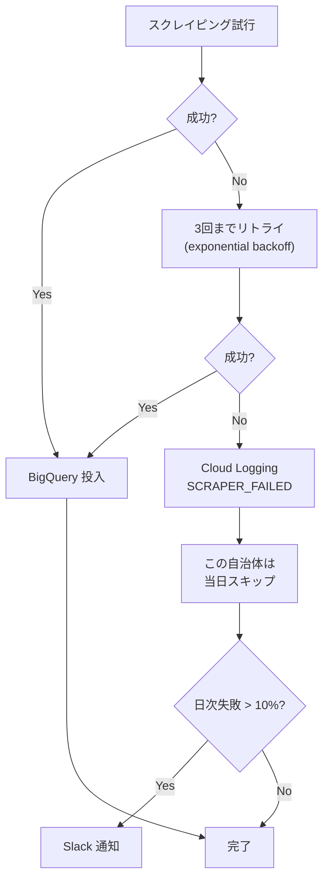

# DATA_SOURCES.md — データソース仕様書

> Citify が利用する各データソースの取得方法、レート制限、注意事項を記述します。
> Coding Agent はスクレイパー実装時に必ずこのファイルを参照してください。

---

## 0. 共通遵守事項（全データソース）

### 0.1 倫理・法的遵守

- **robots.txt を必ず尊重する**（自動チェック実装必須）
- **利用規約を読み、転載・再配布の制限を遵守する**
- **議事録の全文転載は禁止**。要約 + 原典URLの形式に統一
- **取得データは内部 RAG として保持**、再配布しない
- **クロール頻度はサイト負担を考慮**（最低1秒間隔、推奨5秒）

### 0.2 技術的遵守

- **User-Agent ヘッダーに連絡先を含める**：`Citify-Hackathon/0.1 (+https://github.com/{user}/citify)`
- **キャッシュを徹底**：同じデータを24時間以内に再取得しない
- **失敗時のリトライ**：exponential backoff、最大3回
- **タイムアウト**：30秒
- **エラーは Cloud Logging に記録**、Slack 通知（critical のみ）

### 0.3 BigQuery 共通スキーマ

すべてのソースで以下を保証：

```sql
CREATE TABLE citify_analytics.{source}_raw (
  id STRING NOT NULL,                -- ソース固有のID
  source STRING NOT NULL,            -- 'kokkai' / 'kaigiroku' / 'press' 等
  municipality_code STRING,          -- 自治体コード (国会の場合 '00000')
  meeting_url STRING,
  date DATE,
  content_text STRING,
  speaker STRING,
  speaker_group STRING,              -- 政党・所属
  raw_json STRING,                   -- 取得時のオリジナル JSON
  fetched_at TIMESTAMP NOT NULL
)
PARTITION BY date
CLUSTER BY municipality_code, source;
```

---

## 1. 国会会議録 検索API（最重要・必須）

### 1.1 概要
国立国会図書館が公開する API。明治時代以降の国会議事録（衆議院・参議院・各委員会）を全文検索可能。

### 1.2 エンドポイント

| 用途 | URL |
|---|---|
| 発言取得 | `https://kokkai.ndl.go.jp/api/speech` |
| 会議録単位 | `https://kokkai.ndl.go.jp/api/meeting` |
| 会議録一覧（リスト） | `https://kokkai.ndl.go.jp/api/meeting_list` |

### 1.3 認証
**不要**

### 1.4 主要パラメータ

```
recordPacking=json    必須: JSON 出力
from=2026-05-01       開始日 (YYYY-MM-DD)
until=2026-05-19      終了日
speaker=石破茂        発言者で絞込
nameOfHouse=衆議院    院名
nameOfMeeting=本会議  会議名
any=家賃補助          キーワード
maximumRecords=30     最大取得件数 (1-100)
startRecord=1         開始位置 (ページング)
```

### 1.5 レスポンス例

```json
{
  "numberOfRecords": 1247,
  "numberOfReturn": 30,
  "startRecord": 1,
  "speechRecord": [
    {
      "speechID": "121505254X01620260518_001",
      "issueID": "121505254X01620260518",
      "imageKind": "会議録",
      "session": 215,
      "nameOfHouse": "衆議院",
      "nameOfMeeting": "本会議",
      "issue": "第16号",
      "date": "2026-05-18",
      "speechOrder": 1,
      "speaker": "○○○○",
      "speakerYomi": "○○ ○○",
      "speakerGroup": "○○○党",
      "speakerPosition": "",
      "speech": "ただいまから本会議を開きます。本日の議事は…",
      "startPage": "1",
      "speechURL": "https://kokkai.ndl.go.jp/...",
      "meetingURL": "https://kokkai.ndl.go.jp/..."
    }
  ]
}
```

### 1.6 レート制限と注意

- **明示的なレート制限はないが、紳士的に運用すること**（推奨：1秒間隔）
- 大量取得は **夜間（22:00-06:00 JST）に実施**
- 1日 10,000 リクエスト程度に抑える

### 1.7 実装方針

```python
# scrapers/kokkai/client.py

import httpx
from datetime import date

class KokkaiClient:
    BASE_URL = "https://kokkai.ndl.go.jp/api"

    def __init__(self):
        self.client = httpx.AsyncClient(
            headers={"User-Agent": "Citify-Hackathon/0.1 (+https://github.com/.../citify)"},
            timeout=30.0,
        )

    async def fetch_speeches(
        self,
        from_date: date,
        until_date: date,
        keyword: str | None = None,
        max_records: int = 100,
    ) -> list[dict]:
        params = {
            "recordPacking": "json",
            "from": from_date.isoformat(),
            "until": until_date.isoformat(),
            "maximumRecords": max_records,
        }
        if keyword:
            params["any"] = keyword

        # ページング
        all_records = []
        start = 1
        while True:
            params["startRecord"] = start
            response = await self.client.get(f"{self.BASE_URL}/speech", params=params)
            response.raise_for_status()
            data = response.json()
            records = data.get("speechRecord", [])
            all_records.extend(records)
            if len(records) < max_records:
                break
            start += max_records
            await asyncio.sleep(1.0)  # レート制限

        return all_records
```

### 1.8 BigQuery 投入

```sql
INSERT INTO citify_analytics.speeches (
  id, source, municipality_code, meeting_url, date,
  content_text, speaker, speaker_group, raw_json, fetched_at
) VALUES (
  @speechID, 'kokkai', '00000', @meetingURL, @date,
  @speech, @speaker, @speakerGroup, @rawJson, CURRENT_TIMESTAMP()
);
```

---

## 2. 自治体議事録 — kaigiroku.net (DiscussNetPremium)

### 2.1 概要
NTT-AT が提供する自治体議事録検索システム。約 350+ 自治体が採用。同じURL構造のため **1パーサーで全自治体カバー** できる。

### 2.2 URL パターン

```
https://ssp.kaigiroku.net/tenant/{tenant_id}/SpMinuteView.html?...
https://ssp.kaigiroku.net/tenant/{tenant_id}/MinuteView.html?...
```

### 2.3 tenant_id 一覧（一部）

| 自治体 | tenant_id |
|---|---|
| 東京都世田谷区 | `setagaya` |
| 東京都新宿区 | `shinjuku` |
| 横浜市 | `yokohama` |
| 大阪市 | `osaka` |
| 札幌市 | `sapporo` |
| 仙台市 | `sendai` |
| 名古屋市 | `nagoya` |
| 福岡市 | `fukuoka` |
| (※詳細は municipality_master.csv に保存) | |

### 2.4 取得フロー

```
1. tenant/{tenant_id}/SpFrameView.html?... で会議一覧
2. 各会議の会議録URLを抽出
3. SpMinuteView.html?... を取得し HTML パース
4. 発言ブロック (<div class="speech">等) を抽出
5. 構造化して BigQuery 投入
```

### 2.5 利用規約・robots.txt

- **トップページ・robots.txt を必ず確認**
- 多くの自治体で **「商用利用は要相談」**
- 議事録の **要約 + 原典リンク** での利用は通常認められている
- **クロール間隔は最低 5 秒**

### 2.6 BigQuery 投入

```python
# scrapers/kaigiroku_net/parser.py

from bs4 import BeautifulSoup
import httpx

async def fetch_meeting_list(tenant_id: str, period_days: int = 30) -> list[Meeting]:
    """指定tenant の最近の会議一覧を取得"""
    url = f"https://ssp.kaigiroku.net/tenant/{tenant_id}/SpFrameView.html"
    async with httpx.AsyncClient() as client:
        response = await client.get(url, follow_redirects=True)
        soup = BeautifulSoup(response.text, "lxml")
        # ... HTMLパース処理
    return meetings

async def fetch_minute_speeches(tenant_id: str, meeting_id: str) -> list[Speech]:
    """会議の発言一覧を取得"""
    # ... 同様
```

### 2.7 失敗時の対応

- HTML構造が変わった自治体はスキップ、ログに記録
- `scrapers/kaigiroku_net/fixtures/` に各自治体の HTML サンプルを保存し、CI で構造検証

---

## 3. 自治体議事録 — DB-Search（150+自治体）

### 3.1 概要
大和速記情報センターが提供する議事録検索システム。

### 3.2 URL パターン

```
https://www.dbsr.{customer_name}-city.jp/...
```

### 3.3 注意事項

- kaigiroku.net とは構造が **大きく異なる**
- 自治体ごとに URL prefix が違うため、自治体マスタに保持
- レート制限：**10 秒間隔推奨**

### 3.4 実装優先度

`FEATURES.md` で **Should (B-6)** 扱い。kaigiroku.net で 350+ 自治体カバー済みのため、本機能は **Week 5 で実装、間に合わなければ降格**。

---

## 4. 自治体プレスリリース RSS

### 4.1 概要
都道府県47 + 政令市20 + 中核市62 = **約 130 自治体** のプレスリリース RSS を取得。

### 4.2 RSS URL の例

| 自治体 | RSS URL |
|---|---|
| 東京都 | `https://www.metro.tokyo.lg.jp/tosei/hodohappyo/press/rss.xml` |
| 横浜市 | `https://www.city.yokohama.lg.jp/rss/...` |
| 大阪府 | `https://www.pref.osaka.lg.jp/.../press.xml` |
| (※詳細は municipality_master.csv の `press_rss_url` カラムに保存) | |

### 4.3 取得フロー

```python
# scrapers/press_rss/client.py

import feedparser
import httpx

async def fetch_rss(rss_url: str) -> list[PressItem]:
    async with httpx.AsyncClient() as client:
        response = await client.get(rss_url, timeout=30.0)
        feed = feedparser.parse(response.text)
        return [
            PressItem(
                title=entry.title,
                link=entry.link,
                published=entry.published,
                summary=entry.summary,
            )
            for entry in feed.entries
        ]
```

### 4.4 注意事項

- RSS の **更新頻度はサイトによって異なる**（毎日更新もあれば週1も）
- フォーマットが **RSS 2.0 / Atom 1.0** で混在 → `feedparser` で吸収可能
- 一部自治体は **RSS なし** → ホームページのスクレイピングが必要（後回し）

---

## 5. e-Gov パブリックコメント

### 5.1 概要
総務省が運営。中央省庁の意見公募中の案件を取得可能。

### 5.2 エンドポイント

```
https://public-comment.e-gov.go.jp/servlet/...
```

### 5.3 取得方法
公開APIは存在せず、HTML スクレイピング。

### 5.4 実装優先度

`FEATURES.md` で **Could (C-3)**。**間に合えば実装、間に合わなければ諦める**。

---

## 6. 政府審議会議事録

### 6.1 概要
こども家庭庁、厚労省、文科省、経産省など各省庁の審議会議事録。会期外の素材として有用。

### 6.2 取得方法
省庁ごとにバラバラ。HTMLスクレイピング or PDF パース（Document AI）が必要。

### 6.3 実装優先度

`FEATURES.md` で **Could (C-5)**。**Week 6 以降の余力次第**。

---

## 7. 自治体公報 PDF

### 7.1 概要
各自治体が PDF で発行する公報。条例改正・予算等の最新情報。

### 7.2 取得・パース方法

- 自治体 HP から PDF URL を取得
- **Document AI** で構造化パース
- BigQuery に投入

### 7.3 実装優先度

`FEATURES.md` で **Could (C-6)**。**Document AI のコストが高いため、最後の Could**。

---

## 8. 自治体オープンデータポータル

### 8.1 概要
内閣府の「推奨データセット」に準拠した自治体のオープンデータを取得。

### 8.2 主要ポータル

| 名前 | URL | 提供形式 |
|---|---|---|
| 内閣府 オープンデータ | https://www.data.go.jp/ | CKAN API |
| 東京都 オープンデータ | https://portal.data.metro.tokyo.lg.jp/ | CKAN API |
| 横浜市 オープンデータ | https://data.city.yokohama.lg.jp/ | CKAN API |

### 8.3 用途
議題の裏付けデータとして利用（例：「子育て支援費の推移」を議論時に提示）。

### 8.4 実装優先度

`FEATURES.md` で **Could (C-4)**。

---

## 9. Wikipedia API（用語解説用）

### 9.1 概要
役所言葉を翻訳する際の補助知識として、Wikipedia 日本語版から用語解説を取得。

### 9.2 エンドポイント

```
https://ja.wikipedia.org/api/rest_v1/page/summary/{title}
```

### 9.3 認証
**不要**、ただし User-Agent 必須。

### 9.4 利用例

```python
# scrapers/wikipedia/client.py

async def get_term_summary(term: str) -> dict:
    url = f"https://ja.wikipedia.org/api/rest_v1/page/summary/{term}"
    async with httpx.AsyncClient() as client:
        response = await client.get(
            url,
            headers={"User-Agent": "Citify/0.1 (+https://...)"}
        )
        return response.json()
```

### 9.5 利用方針

- 翻訳エージェントが「専門用語」を検出したときに **オンデマンドで取得**
- Vertex AI RAG にも投入し、セマンティック検索可能に
- 取得した summary は Firestore にキャッシュ（24時間有効）

---

## 10. 自治体マスタ CSV (初期データ)

### 10.1 ファイル名
`infra/seed/municipality_master.csv`

### 10.2 スキーマ

```csv
municipality_code,name,prefecture,kana,population,
scraper_type,tenant_id,press_rss_url,opendata_url,
tier,is_active,
notes
```

### 10.3 サンプル

```csv
municipality_code,name,prefecture,kana,population,scraper_type,tenant_id,press_rss_url,opendata_url,tier,is_active,notes
13112,世田谷区,東京都,セタガヤク,915000,kaigiroku,setagaya,https://...,https://...,1,true,優先対応
13104,新宿区,東京都,シンジュクク,346000,kaigiroku,shinjuku,https://...,https://...,1,true,
13113,渋谷区,東京都,シブヤク,228000,kaigiroku,shibuya,https://...,https://...,1,true,
14100,横浜市,神奈川県,ヨコハマシ,3777000,kaigiroku,yokohama,https://...,https://...,1,true,
27100,大阪市,大阪府,オオサカシ,2750000,kaigiroku,osaka,https://...,https://...,1,true,
01100,札幌市,北海道,サッポロシ,1971000,kaigiroku,sapporo,https://...,https://...,1,true,
00000,国会,国,コッカイ,0,kokkai,,,1,true,国会会議録
```

### 10.4 Tier 定義

| Tier | 説明 | 目標カバレッジ |
|---|---|---|
| 1 | 最優先対応自治体 | 50 自治体 |
| 2 | Week 5 で追加対応 | 200 自治体 |
| 3 | 余力時に対応 | 500+ 自治体 |

### 10.5 取得元

- 全国 1,788 自治体: 総務省「全国地方公共団体コード」CSV
- kaigiroku.net 対応自治体: NTT-AT 公式ページから手動収集
- press_rss_url: 各自治体 HP から手動収集 (Week 0 で作業)

---

## 11. スクレイピング失敗時のフォールバック戦略



---

## 12. データ取得スケジュール

| ソース | 頻度 | トリガ | 実行時刻(JST) |
|---|---|---|---|
| 国会API | 日次 | Cloud Scheduler | 05:00 |
| kaigiroku.net | 週次 | Cloud Scheduler | 月-金 06:00 |
| プレスRSS | 日次 | Cloud Scheduler | 05:30, 12:00 |
| e-Gov パブコメ | 週次 | Cloud Scheduler | 月曜 07:00 |
| 政府審議会 | 週次 | Cloud Scheduler | 火曜 07:00 |
| Wikipedia | オンデマンド | API 呼び出し時 | — |
| オープンデータ | 月次 | Cloud Scheduler | 1日 03:00 |

---

## 13. データ取得テスト

各スクレイパーに対し、HTML fixture を `scrapers/{source}/fixtures/` に保存し、構造変化を検知する unit test を作成：

```python
# scrapers/kaigiroku_net/test_parser.py

def test_parse_speech_setagaya():
    with open("fixtures/setagaya_2026-05-15.html") as f:
        html = f.read()
    speeches = parse_meeting_html(html, tenant_id="setagaya")
    assert len(speeches) > 0
    assert speeches[0].speaker
    assert speeches[0].content
```

---

## 14. 改訂履歴

- 2026-05-19 v0.1 初版作成
