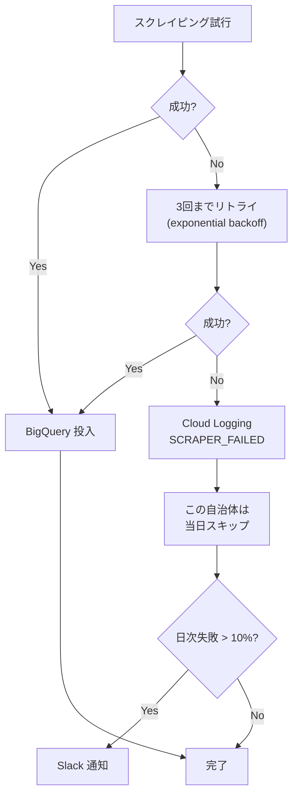

# DATA_SOURCES.md — データソース仕様書

> Citify が利用する各データソースの取得方法、レート制限、注意事項を記述します。
> Coding Agent はスクレイパー実装時に必ずこのファイルを参照してください。

---

## 0. 共通遵守事項（全データソース）

### 0.1 倫理・法的遵守

- **robots.txt を必ず尊重する**（自動チェック実装必須）
- **利用規約を読み、転載・再配布の制限を遵守する**
- **議事録の全文転載は禁止**。要約 + 原典URLの形式に統一
- **取得データは内部 RAG として保持**、再配布しない
- **クロール頻度はサイト負担を考慮**（最低1秒間隔、推奨5秒）

### 0.2 技術的遵守

- **User-Agent ヘッダーに連絡先を含める**：`Citify-Hackathon/0.1 (+https://github.com/{user}/citify)`
- **キャッシュを徹底**：同じデータを24時間以内に再取得しない
- **失敗時のリトライ**：exponential backoff、最大3回
- **タイムアウト**：30秒
- **エラーは Cloud Logging に記録**、Slack 通知（critical のみ）

### 0.3 BigQuery 共通スキーマ

すべてのソースで以下を保証：

```sql
CREATE TABLE citify_analytics.{source}_raw (
  id STRING NOT NULL,                -- ソース固有のID
  source STRING NOT NULL,            -- 'kokkai' / 'kaigiroku' / 'press' 等
  municipality_code STRING,          -- 自治体コード (国会の場合 '00000')
  meeting_url STRING,
  date DATE,
  content_text STRING,
  speaker STRING,
  speaker_group STRING,              -- 政党・所属
  raw_json STRING,                   -- 取得時のオリジナル JSON
  fetched_at TIMESTAMP NOT NULL
)
PARTITION BY date
CLUSTER BY municipality_code, source;
```

---

## 1. 国会会議録 検索API（最重要・必須）

### 1.1 概要
国立国会図書館が公開する API。明治時代以降の国会議事録（衆議院・参議院・各委員会）を全文検索可能。

### 1.2 エンドポイント

| 用途 | URL |
|---|---|
| 発言取得 | `https://kokkai.ndl.go.jp/api/speech` |
| 会議録単位 | `https://kokkai.ndl.go.jp/api/meeting` |
| 会議録一覧（リスト） | `https://kokkai.ndl.go.jp/api/meeting_list` |

### 1.3 認証
**不要**

### 1.4 主要パラメータ

```
recordPacking=json    必須: JSON 出力
from=2026-05-01       開始日 (YYYY-MM-DD)
until=2026-05-19      終了日
speaker=石破茂        発言者で絞込
nameOfHouse=衆議院    院名
nameOfMeeting=本会議  会議名
any=家賃補助          キーワード
maximumRecords=30     最大取得件数 (1-100)
startRecord=1         開始位置 (ページング)
```

### 1.5 レスポンス例

```json
{
  "numberOfRecords": 1247,
  "numberOfReturn": 30,
  "startRecord": 1,
  "speechRecord": [
    {
      "speechID": "121505254X01620260518_001",
      "issueID": "121505254X01620260518",
      "imageKind": "会議録",
      "session": 215,
      "nameOfHouse": "衆議院",
      "nameOfMeeting": "本会議",
      "issue": "第16号",
      "date": "2026-05-18",
      "speechOrder": 1,
      "speaker": "○○○○",
      "speakerYomi": "○○ ○○",
      "speakerGroup": "○○○党",
      "speakerPosition": "",
      "speech": "ただいまから本会議を開きます。本日の議事は…",
      "startPage": "1",
      "speechURL": "https://kokkai.ndl.go.jp/...",
      "meetingURL": "https://kokkai.ndl.go.jp/..."
    }
  ]
}
```

### 1.6 レート制限と注意

- **明示的なレート制限はないが、紳士的に運用すること**（推奨：1秒間隔）
- 大量取得は **夜間（22:00-06:00 JST）に実施**
- 1日 10,000 リクエスト程度に抑える

### 1.7 実装方針

```python
# scrapers/kokkai/client.py

import httpx
from datetime import date

class KokkaiClient:
    BASE_URL = "https://kokkai.ndl.go.jp/api"

    def __init__(self):
        self.client = httpx.AsyncClient(
            headers={"User-Agent": "Citify-Hackathon/0.1 (+https://github.com/.../citify)"},
            timeout=30.0,
        )

    async def fetch_speeches(
        self,
        from_date: date,
        until_date: date,
        keyword: str | None = None,
        max_records: int = 100,
    ) -> list[dict]:
        params = {
            "recordPacking": "json",
            "from": from_date.isoformat(),
            "until": until_date.isoformat(),
            "maximumRecords": max_records,
        }
        if keyword:
            params["any"] = keyword

        # ページング
        all_records = []
        start = 1
        while True:
            params["startRecord"] = start
            response = await self.client.get(f"{self.BASE_URL}/speech", params=params)
            response.raise_for_status()
            data = response.json()
            records = data.get("speechRecord", [])
            all_records.extend(records)
            if len(records) < max_records:
                break
            start += max_records
            await asyncio.sleep(1.0)  # レート制限

        return all_records
```

### 1.8 BigQuery 投入

```sql
INSERT INTO citify_analytics.speeches (
  id, source, municipality_code, meeting_url, date,
  content_text, speaker, speaker_group, raw_json, fetched_at
) VALUES (
  @speechID, 'kokkai', '00000', @meetingURL, @date,
  @speech, @speaker, @speakerGroup, @rawJson, CURRENT_TIMESTAMP()
);
```

---

## 2. 自治体議事録 — kaigiroku.net (DiscussNetPremium)

> 📝 **2026-05-20 改訂**: Week 0 構造調査 (`docs/scrapers/kaigiroku_net_recon.md`) で当初想定の前提が複数誤っていたことが判明したため大幅改訂。

### 2.1 概要

株式会社会議録研究所 + NTT-AT が共同開発する自治体議事録検索システム。**540 自治体が採用** (2025/7 時点、出典: <https://www.kaigiroku.co.jp/contents/gikai/>)。

**配信モデル 3 種類**:

| モデル | URL パターン | 例 |
|---|---|---|
| **中央型** | `https://ssp.kaigiroku.net/tenant/{tenant_id}/...` | 大阪市 (`cityosaka`)、岡山県 (`prefokayama`)、高知県 (`tosa`) |
| **白ラベル型** | 自治体独自ドメイン (DiscussNet エンジンを別ホストで稼働) | 横浜市 (`giji.city.yokohama.lg.jp/tenant/yokohama/`) |
| **別ベンダ(対象外)** | `*.gijiroku.com/voices/*.asp`、`*.lg.jp/voices/*` | 札幌市、世田谷区 — **A-4 対象外、C-2 系で別途検討** |

中央型・白ラベル型は **同じ DiscussNet HTML テンプレート** を使用 → **1 パーサーで両方カバー可能**。

### 2.2 URL パターン

**中央型 (ssp.kaigiroku.net 配下)**:
```
https://ssp.kaigiroku.net/tenant/{tenant_id}/pg/index.html      # メニュー
https://ssp.kaigiroku.net/tenant/{tenant_id}/MinuteSearch.html  # 検索 UI (SPA)
https://ssp.kaigiroku.net/tenant/{tenant_id}/MinuteBrowse.html  # 閲覧 UI (SPA)
https://ssp.kaigiroku.net/tenant/{tenant_id}/SpTop.html         # スマホ版
```

**白ラベル型 (例: 横浜市)**:
```
http://giji.city.yokohama.lg.jp/tenant/yokohama/pg/index.html
http://giji.city.yokohama.lg.jp/tenant/yokohama/MinuteSearch.html
http://giji.city.yokohama.lg.jp/tenant/yokohama/MinuteBrowse.html
```

→ **`/tenant/{tenant_id}/` 以下のパス構造は両モデルで同一**。URL ベースは `municipality_master.csv` に `scraper_base_url` カラム追加で表現する想定 (Phase 2)。

### 2.3 tenant_id 一覧(暫定)

> ⚠️ **重要**: 当初リストにあった `setagaya`, `sapporo` は **DiscussNet ではなく別ベンダ (VOICES/Web 系)** — **§3 (voices_asp)** で扱う。Week 0 調査で判明、A-4 の対象から除外。

| 自治体 | tenant_id | モデル | 確認状況 |
|---|---|---|---|
| 大阪市 | `cityosaka` | 中央型 | ✅ 確認済 (meta-refresh で SpTop へ) |
| 高知県 | `tosa` | 中央型 | ✅ 確認済 (Legacy template) |
| 岡山県 | `prefokayama` | 中央型 | ✅ 確認済 (Modern template、検証メイン) |
| 大阪府 | `prefosaka` | 中央型 | 🟡 検索結果のみ確認 |
| 大分県 | `prefoita` | 中央型 | 🟡 検索結果のみ確認 |
| 横浜市 | `yokohama` | 白ラベル | ✅ 確認済 (HTTP, Shift_JIS) |
| ~~東京都世田谷区~~ | ~~`setagaya`~~ | **別ベンダ(対象外)** | ❌ `/voices/` 系へ転送 |
| ~~札幌市~~ | ~~`sapporo`~~ | **別ベンダ(対象外)** | ❌ `sapporo.gijiroku.com` |
| (※残り 535 件は Phase 2 で municipality_master.csv に補完) | | | |

### 2.4 取得フロー (Playwright 必須)

DiscussNet は **SPA + 内部 API (JSONP)** で動作するため、BeautifulSoup + httpx の単純構成では会議一覧データを取得できない。**Playwright + headless Chromium が必須**。

```
1. Playwright で MinuteBrowse.html (or SpTop.html) を開く
2. SPA が描画完了するまで wait_for_selector("#council_list tr")
3. tbody#council_list の <tr> を抽出 → 会議メタ (年度・種類・会議名)
4. 各会議のリンクから個別議事録ページに遷移
5. 発言ブロックを抽出 (selector は Week 2 実装時に確定)
6. Shift_JIS / UTF-8 を tenant ごとに自動判定 (charset meta タグ参照)
7. 構造化して BigQuery 投入
```

### 2.5 利用規約・robots.txt

**robots.txt (ssp.kaigiroku.net)** の解析結果 (2026-05-20 取得):

```
User-agent: *
Disallow: /
Allow: /tenant/
Disallow: /tenant/js/
Disallow: /tenant/css/
Disallow: /tenant/help/
Disallow: /tenant/stats/
```

**重要な遵守ルール**:

- ✅ `/tenant/{id}/*.html` の HTML ページ取得は **明示的に許可**
- ❌ **内部 API `/dnp/search/councils/*` の直接コールは禁止** (`Disallow: /` で包括的に禁止、Allow にも含まれない)
- ✅ **Playwright (ブラウザ的振る舞い) で SPA を描画して結果を取得** するのは正常なユーザー振る舞いとして許容
- 多くの自治体で「商用利用は要相談」 — Citify はハッカソン応募作品として位置付け、商用ではない
- 議事録の **要約 + 原典リンク** での利用は通常認められている (PROJECT.md §5.3 と整合)
- **クロール間隔は最低 5 秒** (Playwright の起動オーバーヘッドで自然と達成される傾向)

### 2.6 実装方針 (scrapers/kaigiroku_net/)

```python
# scrapers/kaigiroku_net/client.py

from __future__ import annotations

from playwright.async_api import async_playwright

DISCUSS_TENANT_URL_TEMPLATES = {
    # tenant_id → ベース URL (中央型 / 白ラベル を吸収)
    "prefokayama": "https://ssp.kaigiroku.net/tenant/prefokayama",
    "yokohama":    "http://giji.city.yokohama.lg.jp/tenant/yokohama",
    # ... municipality_master.csv から読み込み
}


async def fetch_meeting_list(tenant_id: str) -> list[Meeting]:
    """指定tenant の会議一覧を Playwright で取得 (SPA レンダリング完了まで待機)"""
    base_url = DISCUSS_TENANT_URL_TEMPLATES[tenant_id]
    url = f"{base_url}/MinuteBrowse.html"

    async with async_playwright() as p:
        browser = await p.chromium.launch(headless=True)
        page = await browser.new_page()
        await page.goto(url, wait_until="networkidle")
        # SPA の council_list が埋まるまで待機
        await page.wait_for_selector("#council_list tr")
        rows = await page.query_selector_all("#council_list tr")
        # ... DOM 抽出
        await browser.close()
    return meetings


async def fetch_minute_speeches(tenant_id: str, meeting_url: str) -> list[Speech]:
    """個別会議録ページから発言ブロックを抽出 (同じく Playwright)"""
    # ... 同様、selector は Week 2 で確定
```

### 2.7 失敗時の対応

- HTML 構造が変わった自治体はスキップ、Cloud Logging に `SCRAPER_FAILED` で記録
- `scrapers/kaigiroku_net/fixtures/` に各自治体の HTML サンプルを保存し、CI で構造検証
- **Drop Point ルール** (詳細は `docs/scrapers/kaigiroku_net_recon.md §4.3`):
  - Week 2 中日 (6/4 水) までに Playwright で 1 自治体動かなければ → A-4 を Should に降格
  - Chromium OOM 頻発 → Cloud Run メモリ 1 GiB → 2 GiB に増設
  - selector 設計が破綻 → 中央型のみに範囲縮小、白ラベルは Phase 3 へ

---

## 3. 自治体議事録 — voices_asp (VOICES/Web 系)

> 📝 **2026-05-20 新設**: Week 0 構造調査 (`docs/scrapers/voices_asp_recon.md`) を反映。判定 **🟢 GREEN — BeautifulSoup + httpx で実装容易**(Playwright 不要)。

### 3.1 概要

製品名 **VOICES/Web** (HTML タイトルから判明)。DiscussNet (会議録研究所/NTT-AT) とは **別ベンダ**、ASP/ASP.NET ベースで多数の自治体が採用。Tier 1 自治体だけで 9 件確認済。札幌市・東京 23 区中 7 区(港・台東・世田谷・杉並・板橋・足立・江戸川)・大田区。

**配信モデル 3 種類** (DiscussNet と同じ分類が voices_asp にも適用される):

| モデル | URL パターン | 例 |
|---|---|---|
| **中央型** | `https://{name}.gijiroku.com/voices/...` | 札幌市 (`sapporo.gijiroku.com`)、台東区 (`taito.gijiroku.com`)、杉並区 (`suginami.gijiroku.com`)、板橋区 (`itabashi.gijiroku.com`) |
| **白ラベル(サブドメイン)** | 自治体独自サブドメイン | 港区 (`gikai2.city.minato.tokyo.jp/voices`)、世田谷区 (`kugi.city.setagaya.tokyo.jp/voices`)、江戸川区 (`gikai.city.edogawa.tokyo.jp/voices`) |
| **白ラベル(独自ドメイン)** | 自治体独自ドメイン | 足立区 (`www.gikai-adachi.jp/voices`)、大田区 (`www.gikai-ota-tokyo.jp/ota` — `/voices/` でなく `/ota/` 変則サブパス) |

3 モデルすべてで **同一テンプレート**。

### 3.2 URL パターン

`/voices/` 配下に `g0Xv_*.asp` 形式のファイルが規約的に配置される。

| ファイル | 役割 | 主要パラメタ |
|---|---|---|
| `{base}/voices/index.asp` | トップ (メニュー) | なし |
| `{base}/voices/g08v_viewh.asp` | 本会議録 年度一覧 | なし(年度リスト出力) |
| `{base}/voices/g08v_viewh.asp?Sflg=11&FYY=N&TYY=N` | 本会議録 N 年分会議リスト | `Sflg=11`, `FYY=YYYY`, `TYY=YYYY` |
| `{base}/voices/g08v_viewh.asp?Sflg=10` | 本会議録 全件 | `Sflg=10` |
| `{base}/voices/g08v_viewh.asp?Sflg=21&FYY=N&TYY=N` | 臨時会 N 年分 | `Sflg=21` |
| `{base}/voices/g08v_viewh.asp?Sflg=20` | 臨時会 全件 | `Sflg=20` |
| `{base}/voices/g08v_views.asp` | 委員会記録 年度一覧 | (同様の構造) |
| `{base}/voices/g07v_search.asp` | 詳細検索 UI | フォーム POST |

`/voices/cgi/` 配下は内部 CGI(robots.txt で Disallow)、`g0X_Video_*.asp` は動画ページ(同 Disallow)で、いずれも Citify のスコープ外。

### 3.3 採用自治体一覧 (Tier 1 確認済 9 件)

| 自治体 | scraper_base_url | モデル |
|---|---|---|
| 札幌市 | `https://sapporo.gijiroku.com/voices` | 中央型 |
| 港区 | `https://gikai2.city.minato.tokyo.jp/voices` | 白ラベル(サブドメイン) |
| 台東区 | `https://taito.gijiroku.com/voices` | 中央型 |
| 世田谷区 | `https://kugi.city.setagaya.tokyo.jp/voices` | 白ラベル(サブドメイン) |
| 杉並区 | `https://suginami.gijiroku.com/voices` | 中央型 |
| 板橋区 | `https://itabashi.gijiroku.com/voices` | 中央型 |
| 足立区 | `https://www.gikai-adachi.jp/voices` | 白ラベル(独自ドメイン) |
| 江戸川区 | `https://www.gikai.city.edogawa.tokyo.jp/voices` | 白ラベル(サブドメイン) |
| 大田区 | `https://www.gikai-ota-tokyo.jp/ota` | 白ラベル(`/ota/` 変則サブパス) |

(※残り採用自治体は Phase 3 で `municipality_master.csv` に補完)

### 3.4 取得フロー (BeautifulSoup + httpx)

DiscussNet と違い **静的 XHTML サーバーサイドレンダリング** なので Playwright 不要。

```
1. {base}/voices/g08v_viewh.asp を GET → <ul class="kaigi_view"> 内の <li><a href="?Sflg=11&FYY=N&TYY=N"> を抽出 (年度リスト)
2. 各年度ページを GET (Sflg=11&FYY=N&TYY=N) → 会議リンク一覧を抽出
3. 個別会議ページを GET → 発言ブロックを抽出 (selector は Week 3 実装時に確定)
4. 委員会記録 (g08v_views.asp) も同様にトラバース
5. Shift_JIS を明示指定して decode (httpx で response.encoding='shift_jis')
6. 構造化して BigQuery 投入 (kaigiroku と共通スキーマ、source='voices_asp')
```

### 3.5 利用規約・robots.txt

3 ドメイン (sapporo.gijiroku.com / gikai2.city.minato.tokyo.jp / www.gikai-adachi.jp) で **完全に同一の robots.txt (1,621 bytes)** が使われており、同一ベンダ管理を裏付けている。

```
User-agent: *
Disallow: /voices/cgi/        ← 内部 CGI スクリプト (禁止)
Disallow: /voices2/cgi/
Disallow: /gikai/cgi/
Disallow: g07_Video_View.asp  ← 動画ページ群 (hot-link 防止のため禁止)
Disallow: g08_Video_View.asp
...
Disallow: /voices/gikaidoc/index.html  ← PDF 索引 (禁止)
```

加えて、SEO Bot (DotBot, SemrushBot, AhrefsBot, BLEXBot, MJ12bot, YandexBot, CCBot, BaiduSpider 等多数) は明示的に全パス Disallow。

**重要な遵守ルール**:

- ✅ `/voices/g08v_viewh.asp` / `g08v_views.asp` / `g07v_search.asp` 等の議事録ページは **明示的に許可** (kaigiroku.net `/dnp/` の Disallow と対照的)
- ❌ `/voices/cgi/` 内部 CGI は禁止 — Citify はアクセスしない
- ❌ 動画ページ群は禁止 — Citify は動画を直接配信しないので無関係
- ✅ 一般的なユーザー UA (Citify-Hackathon/0.1) は SEO Bot リストに該当しないため許可扱い
- **クロール間隔は最低 5 秒** (政治的に静かに運用)
- 文字コードは **Shift_JIS 統一** (`<meta charset=shift_jis>`、httpx で `encoding='shift_jis'` を明示指定必須)

### 3.6 実装方針 (scrapers/voices_asp/)

```python
# scrapers/voices_asp/client.py

from __future__ import annotations

import httpx
from bs4 import BeautifulSoup


async def fetch_year_list(scraper_base_url: str) -> list[dict]:
    """指定自治体の本会議録 年度一覧を取得 (g08v_viewh.asp)"""
    url = f"{scraper_base_url}/g08v_viewh.asp"
    async with httpx.AsyncClient(timeout=30.0) as client:
        response = await client.get(url)
        response.encoding = "shift_jis"   # 明示指定が必須
        soup = BeautifulSoup(response.text, "lxml")
        # <ul class="kaigi_view"> 内のリンクから (年度, Sflg, FYY, TYY) を抽出
        years = []
        for ul in soup.select("ul.kaigi_view"):
            for a in ul.select("li > a"):
                href = a.get("href", "")
                # ?Sflg=11&FYY=YYYY&TYY=YYYY をパース
                # ... URL パラメタ抽出
                years.append({"label": a.text, "href": href})
        return years


async def fetch_meeting_list(scraper_base_url: str, year: int) -> list[dict]:
    """特定年度の会議一覧を取得"""
    url = f"{scraper_base_url}/g08v_viewh.asp"
    params = {"Sflg": "11", "FYY": str(year), "TYY": str(year)}
    # ... 同様
```

### 3.7 失敗時の対応 + Drop Point

- HTML 構造が変わった自治体はスキップ、Cloud Logging に `SCRAPER_FAILED` で記録
- `scrapers/voices_asp/fixtures/` に各自治体の HTML サンプル(年度一覧 / 会議一覧 / 発言ページ)を保存し、CI で構造検証
- **Drop Point ルール** (詳細は `docs/scrapers/voices_asp_recon.md §6`):
  - Week 3 末で 1 自治体動かなければ → 中央型のみに範囲縮小 (sapporo / taito / suginami / itabashi のみ)
  - 個別会議ページの発言抽出が想定外に複雑 → メタ情報のみ取得で妥協、本文は Week 6 まで持ち越し
  - 大田区の `/ota/` 変則サブパスで parser 破綻 → 大田区を一旦 unknown に降格

### 3.8 他系統との比較

| ベンダ | 実装方式 | 1 ページ取得時間 | コンテナサイズ | 月次コスト |
|---|---|---|---|---|
| kokkai (国会 API) | httpx + JSON | 0.3 秒 | base | ~$0 |
| **kaigiroku** (DiscussNet) | **Playwright + Chromium** | 5-10 秒 | +400 MB | ~$0.6 |
| **voices_asp** (VOICES/Web) | **BeautifulSoup + httpx + Shift_JIS** | **0.3-1 秒** | **+50 MB** | **~$0.1** |
| db_search (Week 5 別途) | (未調査、likely BeautifulSoup) | (TBD) | (TBD) | (TBD) |

→ voices_asp は **kaigiroku より全観点で楽**。Phase 2 で確定した「3 系統並行戦略」を技術的に支える役割。

---

## 4. 自治体議事録 — DB-Search（150+自治体）

### 4.1 概要
大和速記情報センターが提供する議事録検索システム。

### 4.2 URL パターン

```
https://www.dbsr.{customer_name}-city.jp/...
```

### 4.3 注意事項

- kaigiroku.net とは構造が **大きく異なる**
- 自治体ごとに URL prefix が違うため、自治体マスタに保持
- レート制限：**10 秒間隔推奨**

### 4.4 実装優先度

`FEATURES.md` で **Should (B-6)** 扱い。kaigiroku.net で 350+ 自治体カバー済みのため、本機能は **Week 5 で実装、間に合わなければ降格**。

---

## 5. 自治体プレスリリース RSS

### 5.1 概要
都道府県47 + 政令市20 + 中核市62 = **約 130 自治体** のプレスリリース RSS を取得。

### 5.2 RSS URL の例

| 自治体 | RSS URL |
|---|---|
| 東京都 | `https://www.metro.tokyo.lg.jp/tosei/hodohappyo/press/rss.xml` |
| 横浜市 | `https://www.city.yokohama.lg.jp/rss/...` |
| 大阪府 | `https://www.pref.osaka.lg.jp/.../press.xml` |
| (※詳細は municipality_master.csv の `press_rss_url` カラムに保存) | |

### 5.3 取得フロー

```python
# scrapers/press_rss/client.py

import feedparser
import httpx

async def fetch_rss(rss_url: str) -> list[PressItem]:
    async with httpx.AsyncClient() as client:
        response = await client.get(rss_url, timeout=30.0)
        feed = feedparser.parse(response.text)
        return [
            PressItem(
                title=entry.title,
                link=entry.link,
                published=entry.published,
                summary=entry.summary,
            )
            for entry in feed.entries
        ]
```

### 5.4 注意事項

- RSS の **更新頻度はサイトによって異なる**（毎日更新もあれば週1も）
- フォーマットが **RSS 2.0 / Atom 1.0** で混在 → `feedparser` で吸収可能
- 一部自治体は **RSS なし** → ホームページのスクレイピングが必要（後回し）

---

## 6. e-Gov パブリックコメント

### 6.1 概要
総務省が運営。中央省庁の意見公募中の案件を取得可能。

### 6.2 エンドポイント

```
https://public-comment.e-gov.go.jp/servlet/...
```

### 6.3 取得方法
公開APIは存在せず、HTML スクレイピング。

### 6.4 実装優先度

`FEATURES.md` で **Could (C-3)**。**間に合えば実装、間に合わなければ諦める**。

---

## 7. 政府審議会議事録

### 7.1 概要
こども家庭庁、厚労省、文科省、経産省など各省庁の審議会議事録。会期外の素材として有用。

### 7.2 取得方法
省庁ごとにバラバラ。HTMLスクレイピング or PDF パース（Document AI）が必要。

### 7.3 実装優先度

`FEATURES.md` で **Could (C-5)**。**Week 6 以降の余力次第**。

---

## 8. 自治体公報 PDF

### 8.1 概要
各自治体が PDF で発行する公報。条例改正・予算等の最新情報。

### 8.2 取得・パース方法

- 自治体 HP から PDF URL を取得
- **Document AI** で構造化パース
- BigQuery に投入

### 8.3 実装優先度

`FEATURES.md` で **Could (C-6)**。**Document AI のコストが高いため、最後の Could**。

---

## 9. 自治体オープンデータポータル

### 9.1 概要
内閣府の「推奨データセット」に準拠した自治体のオープンデータを取得。

### 9.2 主要ポータル

| 名前 | URL | 提供形式 |
|---|---|---|
| 内閣府 オープンデータ | https://www.data.go.jp/ | CKAN API |
| 東京都 オープンデータ | https://portal.data.metro.tokyo.lg.jp/ | CKAN API |
| 横浜市 オープンデータ | https://data.city.yokohama.lg.jp/ | CKAN API |

### 9.3 用途
議題の裏付けデータとして利用（例：「子育て支援費の推移」を議論時に提示）。

### 9.4 実装優先度

`FEATURES.md` で **Could (C-4)**。

---

## 10. Wikipedia API（用語解説用）

### 10.1 概要
役所言葉を翻訳する際の補助知識として、Wikipedia 日本語版から用語解説を取得。

### 10.2 エンドポイント

```
https://ja.wikipedia.org/api/rest_v1/page/summary/{title}
```

### 10.3 認証
**不要**、ただし User-Agent 必須。

### 10.4 利用例

```python
# scrapers/wikipedia/client.py

async def get_term_summary(term: str) -> dict:
    url = f"https://ja.wikipedia.org/api/rest_v1/page/summary/{term}"
    async with httpx.AsyncClient() as client:
        response = await client.get(
            url,
            headers={"User-Agent": "Citify/0.1 (+https://...)"}
        )
        return response.json()
```

### 10.5 利用方針

- 翻訳エージェントが「専門用語」を検出したときに **オンデマンドで取得**
- Vertex AI RAG にも投入し、セマンティック検索可能に
- 取得した summary は Firestore にキャッシュ（24時間有効）

---

## 11. 自治体マスタ CSV (初期データ)

### 11.1 ファイル名
`infra/seed/municipality_master.csv`

### 11.2 スキーマ

```csv
municipality_code,name,prefecture,kana,population,
scraper_type,scraper_base_url,tenant_id,press_rss_url,opendata_url,
tier,is_active,
notes
```

> 📝 Phase 2 (2026-05-20) で `scraper_base_url` カラム追加。詳細は `infra/seed/README.md`。

### 11.3 サンプル

```csv
municipality_code,name,prefecture,kana,population,scraper_type,scraper_base_url,tenant_id,press_rss_url,opendata_url,tier,is_active,notes
00000,国会,国,コッカイ,,kokkai,,,,,1,true,国会会議録 (kokkai.ndl.go.jp/api/speech)
13104,新宿区,東京都,シンジュクク,,kaigiroku,https://ssp.kaigiroku.net/tenant/shinjuku,shinjuku,,,1,false,shinjuku (DiscussNet SPA)
13112,世田谷区,東京都,セタガヤク,,voices_asp,https://kugi.city.setagaya.tokyo.jp/voices,,,,1,false,setagaya (voices_asp vendor)
13118,荒川区,東京都,アラカワク,,kaigiroku,https://ssp.kaigiroku.net/tenant/arakawa,arakawa,,,1,false,arakawa (DiscussNet SPA)
14100,横浜市,神奈川県,ヨコハマシ,,kaigiroku,http://giji.city.yokohama.lg.jp/tenant/yokohama,yokohama,,,1,false,yokohama (DiscussNet white-label; HTTP; Shift_JIS)
01100,札幌市,北海道,サッポロシ,,voices_asp,https://sapporo.gijiroku.com/voices,,,,1,false,sapporo (voices_asp)
```

### 11.4 Tier 定義

| Tier | 説明 | 目標カバレッジ |
|---|---|---|
| 1 | Citify が実装目標とする自治体 (23 区 + 政令市 + 国会) | ~44 件 |
| 2 | Week 5 拡張対象 (中核市・主要地方都市) | 150-300 件 |
| 3 | 余力時 / 対応予定なし | 残り |

### 11.5 取得元

- 全国 1,788 自治体: 総務省「全国地方公共団体コード」CSV (R6.1.1 = 2024-01-01)
- Tier 1 自治体の scraper 情報: `infra/seed/tier1_supplements.csv` (手動メンテ、Phase 2 で 30 件補完済)
- press_rss_url: Phase 3 で各自治体 HP から手動収集予定

---

## 12. スクレイピング失敗時のフォールバック戦略



---

## 13. データ取得スケジュール

| ソース | 頻度 | トリガ | 実行時刻(JST) |
|---|---|---|---|
| 国会API | 日次 | Cloud Scheduler | 05:00 |
| kaigiroku.net | 週次 | Cloud Scheduler | 月-金 06:00 |
| voices_asp | 週次 | Cloud Scheduler | 月-金 06:30 |
| プレスRSS | 日次 | Cloud Scheduler | 05:30, 12:00 |
| e-Gov パブコメ | 週次 | Cloud Scheduler | 月曜 07:00 |
| 政府審議会 | 週次 | Cloud Scheduler | 火曜 07:00 |
| Wikipedia | オンデマンド | API 呼び出し時 | — |
| オープンデータ | 月次 | Cloud Scheduler | 1日 03:00 |

---

## 14. データ取得テスト

各スクレイパーに対し、HTML fixture を `scrapers/{source}/fixtures/` に保存し、構造変化を検知する unit test を作成：

```python
# scrapers/kaigiroku_net/test_parser.py

def test_parse_speech_setagaya():
    with open("fixtures/setagaya_2026-05-15.html") as f:
        html = f.read()
    speeches = parse_meeting_html(html, tenant_id="setagaya")
    assert len(speeches) > 0
    assert speeches[0].speaker
    assert speeches[0].content
```

---

## 15. 改訂履歴

- 2026-05-19 v0.1 初版作成
- 2026-05-20 v0.2 §2 (kaigiroku.net) を Week 0 構造調査結果で大幅改訂。配信モデル 3 分類化、Playwright 必須化、`/dnp/` API の robots.txt Disallow 明示、setagaya/sapporo を別ベンダ判定で除外。詳細: `docs/scrapers/kaigiroku_net_recon.md`
- 2026-05-20 v0.3 **§3 (voices_asp) を新設**(VOICES/Web 系、Tier 1 で 9 自治体カバー、BeautifulSoup で実装可能 GREEN 判定)。旧 §3-§14 を §4-§15 にリナンバリング。自治体マスタ CSV (§11) のスキーマに `scraper_base_url` を追加。詳細: `docs/scrapers/voices_asp_recon.md`
