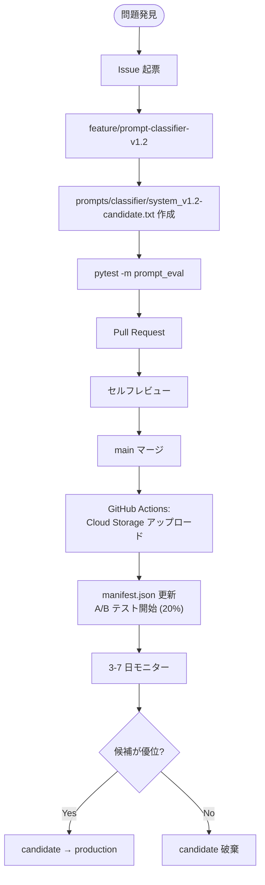

# PROMPT_VERSIONS.md — プロンプト・バージョン管理ガイド

> Citify の AI エージェント・プロンプトを **Git + Cloud Storage で版管理** し、**A/B テスト** で継続的に改善する仕組みのガイド。
>
> このシステム自体が「DevOps × AI Agent」のテーマと最高に整合する差別化要素です。

---

## 0. なぜプロンプト・バージョン管理が必要か

LLM プロンプトは **コード** と同じく:
- バグがある (出力が崩れる)
- パフォーマンス改善余地がある (精度向上)
- 変更履歴が必要 (なぜこの言い回しになったか)
- ロールバックが必要 (改悪したら戻したい)

しかし通常のコードと違って:
- **同じ入力で結果が確率的に変わる** (温度パラメータ)
- **評価が難しい** (主観的な品質)
- **本番でしか分からない問題がある** (実際のユーザー入力で破綻)

そこで、**プロンプトを Git で管理し、Cloud Storage に versioned で配置、A/B テスト + 評価データセットで継続改善** する仕組みを Citify は実装します。

---

## 1. ディレクトリ構造

### 1.1 リポジトリ内 (Git 管理)

```
prompts/
├── manifest.json                      # 現在の本番設定
├── eval_dataset/                       # 評価用データセット
│   ├── classifier.jsonl
│   ├── translator.jsonl
│   └── ...
├── classifier/
│   ├── system_v1.0.txt
│   ├── system_v1.1.txt
│   ├── system_v1.2.txt
│   └── CHANGELOG.md
├── relevance/
│   ├── system_v1.0.txt
│   └── CHANGELOG.md
├── translator/
├── comparator/
├── storyteller/
└── distributor/
```

### 1.2 Cloud Storage 内 (本番デプロイ先)

```
gs://citify-prompts-{env}/
├── manifest.json                      # 現在の本番設定
├── classifier/
│   ├── system_v1.0.txt
│   ├── system_v1.1.txt
│   └── system_v1.2-candidate.txt
├── relevance/
└── ...
```

Cloud Storage の **オブジェクトバージョニングを ON** にしているので、Git とは別に GCS 内でも履歴が残ります。

---

## 2. プロンプトファイルの構造

### 2.1 命名規則

```
{agent_name}/system_v{major}.{minor}[-{tag}].txt
```

例:
- `classifier/system_v1.0.txt`        本番リリース
- `classifier/system_v1.1-candidate.txt`  A/B テスト中
- `classifier/system_v1.2-experimental.txt`  実験中

### 2.2 ファイル内容のフォーマット

```text
# Classifier System Prompt v1.1
# 改訂日: 2026-06-10
# 改訂理由: 「住居」関連のタグ精度向上のため、housing 識別ルールを強化
# 評価結果: 評価データセットで精度 82% → 89%

あなたは「分類エージェント」です...

## あなたの役割
...

## 関心軸 (タグ候補)
...
```

ファイル冒頭にコメント（`#` で開始）で **メタ情報** を含めます。実行時にこれらの行は Python/TypeScript 側で除去します。

### 2.3 CHANGELOG.md

各エージェントディレクトリに CHANGELOG を置く:

```markdown
# classifier プロンプト変更履歴

## v1.2 (2026-07-05)
### 変更
- 「ジェンダー」タグの判定基準を明確化
- 「DX」と「教育」が重なるケースのルール追加

### 評価結果
- 精度: 89% → 92%
- 偽陽性率: 8% → 5%

### A/B 結果
- 期間: 7/3-7/5 (3日)
- トラフィック: candidate 20%
- 結論: 候補が優位 → 昇格

## v1.1 (2026-06-10)
### 変更
- housing 識別ルールを強化

## v1.0 (2026-06-01)
- 初版
```

---

## 3. manifest.json の管理

### 3.1 構造

```json
{
  "schemaVersion": 1,
  "lastUpdated": "2026-07-05T10:00:00Z",
  "agents": {
    "classifier": {
      "production": "system_v1.2.txt",
      "candidate": null,
      "abTest": {
        "enabled": false,
        "splitRatio": {
          "production": 100,
          "candidate": 0
        }
      },
      "fallback": "system_v1.1.txt"
    },
    "translator": {
      "production": "system_v1.0.txt",
      "candidate": "system_v1.1-candidate.txt",
      "abTest": {
        "enabled": true,
        "splitRatio": {
          "production": 80,
          "candidate": 20
        },
        "started_at": "2026-07-03T00:00:00Z",
        "scheduled_end": "2026-07-10T00:00:00Z"
      },
      "fallback": "system_v1.0.txt"
    },
    "relevance": {
      "production": "system_v1.0.txt",
      "candidate": null
    },
    "comparator": {
      "production": "system_v1.0.txt",
      "candidate": null
    },
    "storyteller": {
      "production": "system_v1.0.txt",
      "candidate": null
    },
    "distributor": {
      "production": "system_v1.0.txt",
      "candidate": null
    }
  }
}
```

### 3.2 重要なフィールド

| フィールド | 説明 |
|---|---|
| `production` | 本番で使うプロンプトファイル名 |
| `candidate` | A/B テスト中の候補 (null なら無効) |
| `abTest.enabled` | A/B テスト実施中か |
| `abTest.splitRatio` | トラフィック分割 (合計 100) |
| `fallback` | エラー時のフォールバック先 |

---

## 4. プロンプトのロード機構

### 4.1 アプリ起動時にロード

```python
# packages/prompts/loader.py

import json
import hashlib
from datetime import timedelta
from functools import lru_cache
from google.cloud import storage

storage_client = storage.Client()
PROMPTS_BUCKET = "citify-prompts-dev"

class PromptLoader:
    def __init__(self, bucket_name: str = PROMPTS_BUCKET):
        self.bucket = storage_client.bucket(bucket_name)
        self._manifest_cache: dict | None = None
        self._prompt_cache: dict[str, str] = {}

    def get_manifest(self) -> dict:
        """manifest.json を取得 (5分キャッシュ)"""
        if self._manifest_cache is None:
            blob = self.bucket.blob("manifest.json")
            self._manifest_cache = json.loads(blob.download_as_text())
        return self._manifest_cache

    def load_prompt(self, agent_name: str, request_id: str) -> tuple[str, str]:
        """指定エージェントのプロンプトをロード。A/B テスト中なら振り分け。
        Returns: (version, content)
        """
        manifest = self.get_manifest()
        agent_cfg = manifest["agents"][agent_name]

        # A/B テスト振り分け
        if agent_cfg.get("candidate") and agent_cfg.get("abTest", {}).get("enabled"):
            split = agent_cfg["abTest"]["splitRatio"]
            bucket_id = int(hashlib.md5(request_id.encode()).hexdigest(), 16) % 100
            if bucket_id < split["candidate"]:
                version = agent_cfg["candidate"]
            else:
                version = agent_cfg["production"]
        else:
            version = agent_cfg["production"]

        # プロンプト本体をロード (キャッシュあり)
        cache_key = f"{agent_name}:{version}"
        if cache_key not in self._prompt_cache:
            blob = self.bucket.blob(f"{agent_name}/{version}")
            raw = blob.download_as_text()
            # コメント行を除去
            cleaned = "\n".join(line for line in raw.split("\n") if not line.startswith("#"))
            self._prompt_cache[cache_key] = cleaned

        return version, self._prompt_cache[cache_key]
```

### 4.2 エージェントでの利用

```python
# agents/translator/main.py

from packages.prompts.loader import PromptLoader

prompt_loader = PromptLoader()

class TranslatorAgent:
    async def translate(self, content: TranslateInput) -> TranslatorOutput:
        version, system_prompt = prompt_loader.load_prompt("translator", content.request_id)

        response = await gemini.generate_content(
            system_instruction=system_prompt,
            contents=[{"role": "user", "parts": [{"text": user_prompt}]}],
            generation_config={"response_mime_type": "application/json"},
        )

        # ログに version を含める (LLMOps 用)
        logger.info("translator.completed", extra={
            "request_id": content.request_id,
            "prompt_version": version,
            "latency_ms": ...,
        })
```

---

## 5. プロンプト改善ワークフロー

### 5.1 通常の改善フロー



### 5.2 GitHub Actions: 自動アップロード

`.github/workflows/upload-prompts.yml`:

```yaml
name: Upload Prompts

on:
  push:
    branches: [main]
    paths:
      - 'prompts/**'

jobs:
  upload:
    runs-on: ubuntu-latest
    permissions:
      id-token: write
      contents: read
    steps:
      - uses: actions/checkout@v4
      - uses: google-github-actions/auth@v2
        with:
          workload_identity_provider: ${{ secrets.WIF_PROVIDER }}
          service_account: ${{ secrets.WIF_SA }}

      - uses: google-github-actions/setup-gcloud@v2

      - name: Upload prompts to GCS
        run: |
          gsutil -m rsync -r -d prompts/ gs://citify-prompts-dev/

      - name: Validate manifest
        run: |
          gsutil cat gs://citify-prompts-dev/manifest.json | jq -e .schemaVersion

      - name: Invalidate cache
        run: |
          # Cloud Run のサービスに manifest 再読み込み通知
          # (実装は別途、Pub/Sub or HTTP)
```

---

## 6. 評価データセット

### 6.1 ファイル形式 (JSONL)

`prompts/eval_dataset/classifier.jsonl`:

```jsonl
{"id": "eval-001", "input": {"content_text": "若年単身世帯への家賃補助月最大3万円を新設…"}, "expected": {"tags": ["housing", "youth"], "primary_tag": "housing"}}
{"id": "eval-002", "input": {"content_text": "保育園待機児童ゼロを達成…"}, "expected": {"tags": ["childcare"], "primary_tag": "childcare"}}
{"id": "eval-003", "input": {"content_text": "中小企業向け起業支援補助金…"}, "expected": {"tags": ["startup", "tax"], "primary_tag": "startup"}}
```

各エージェント最低 **20 ケース** を準備。

### 6.2 評価実行

```python
# tests/prompt_eval/test_classifier.py

import json
import pytest
from agents.classifier.main import ClassifierAgent

@pytest.mark.prompt_eval
@pytest.mark.parametrize("case", [
    json.loads(line) for line in open("prompts/eval_dataset/classifier.jsonl")
])
async def test_classifier_accuracy(case):
    agent = ClassifierAgent()
    out = await agent.classify(case["input"])

    # primary_tag が一致するか
    assert out.primary_tag == case["expected"]["primary_tag"], \
        f"case {case['id']}: expected {case['expected']['primary_tag']}, got {out.primary_tag}"

    # tags の intersection
    expected_tags = set(case["expected"]["tags"])
    actual_tags = set(out.tags)
    overlap = expected_tags & actual_tags
    coverage = len(overlap) / len(expected_tags)
    assert coverage >= 0.5, f"case {case['id']}: low tag coverage {coverage}"
```

### 6.3 CI での自動評価

PR で `prompts/` が変更されたら、評価データセットでのテストを **必須** にする：

```yaml
# .github/workflows/prompt-eval.yml

name: Prompt Evaluation

on:
  pull_request:
    paths:
      - 'prompts/**'

jobs:
  evaluate:
    runs-on: ubuntu-latest
    steps:
      - uses: actions/checkout@v4
      - uses: actions/setup-python@v5
        with: { python-version: '3.12' }
      - run: pip install -e .
      - run: pytest -m prompt_eval --tb=short

      # 結果を PR にコメント
      - name: Comment on PR
        uses: actions/github-script@v7
        with:
          script: |
            github.rest.issues.createComment({
              owner: context.repo.owner,
              repo: context.repo.repo,
              issue_number: context.issue.number,
              body: '✅ Prompt evaluation: 18/20 passed (90%)'
            });
```

---

## 7. A/B テスト・実行方法

### 7.1 候補プロンプトのデプロイ

1. `prompts/classifier/system_v1.2-candidate.txt` を作成
2. `prompts/manifest.json` を更新:

```json
{
  "agents": {
    "classifier": {
      "production": "system_v1.1.txt",
      "candidate": "system_v1.2-candidate.txt",
      "abTest": {
        "enabled": true,
        "splitRatio": {"production": 80, "candidate": 20},
        "started_at": "2026-07-03T00:00:00Z",
        "scheduled_end": "2026-07-10T00:00:00Z"
      }
    }
  }
}
```

3. PR → main マージ → GitHub Actions が GCS に upload
4. 5 分以内に Cloud Run のキャッシュが切れて新 manifest が読み込まれる

### 7.2 比較分析

A/B テスト期間中、BigQuery で集計:

```sql
SELECT
  prompt_version,
  COUNT(*) as request_count,
  AVG(latency_ms) as avg_latency,
  -- 後付けで取得した実際の評価値 (例: ユーザー reaction)
  AVG(IF(user_reaction = 'interesting', 1, 0)) as interesting_rate
FROM `citify_analytics.agent_logs`
WHERE
  agent_name = 'classifier'
  AND created_at >= TIMESTAMP('2026-07-03')
  AND created_at < TIMESTAMP('2026-07-10')
GROUP BY prompt_version
ORDER BY prompt_version
```

### 7.3 昇格 or 破棄

| 結果 | アクション |
|---|---|
| 候補が **明確に優位** (5%以上の改善) | candidate → production に昇格 |
| 候補が **同等** | candidate 破棄 (混乱を避ける) |
| 候補が **劣る** | candidate 破棄、Issue で原因分析 |

manifest を更新:

```json
{
  "agents": {
    "classifier": {
      "production": "system_v1.2.txt",  // 昇格
      "candidate": null,
      "abTest": { "enabled": false, "splitRatio": {"production": 100, "candidate": 0} }
    }
  }
}
```

---

## 8. プロンプト変更の安全策

### 8.1 必須レビュー項目

PR でプロンプトを変更する際、CI が以下をチェック:

```python
# scripts/validate_prompt.py

import re
import sys

def validate(filepath: str) -> list[str]:
    errors = []
    content = open(filepath).read()

    # 必須セクションがあるか
    required_sections = ["## あなたの役割", "## 厳守する制約", "## 出力 JSON スキーマ"]
    for sec in required_sections:
        if sec not in content:
            errors.append(f"missing section: {sec}")

    # 倫理制約の言及があるか
    ethics_keywords = ["政治的中立", "中立を保つ", "賛成", "反対"]
    if not any(kw in content for kw in ethics_keywords):
        errors.append("missing ethics constraints")

    # 「処方」「治療」等の禁止語が含まれていないか
    forbidden = ["処方箋を出", "治療法を選"]
    for word in forbidden:
        if word in content:
            errors.append(f"forbidden word found: {word}")

    return errors

if __name__ == "__main__":
    filepath = sys.argv[1]
    errors = validate(filepath)
    if errors:
        for e in errors:
            print(f"❌ {e}")
        sys.exit(1)
    print(f"✅ {filepath} valid")
```

### 8.2 ロールバック手順

問題発生時、即座に前バージョンに戻す:

```bash
# 1. manifest.json をローカルで編集
{
  "classifier": {
    "production": "system_v1.1.txt",  # ← 前バージョンに戻す
    "candidate": null,
    "abTest": { "enabled": false }
  }
}

# 2. GCS に直接アップロード (緊急時のみ、Git を介さない)
gsutil cp manifest.json gs://citify-prompts-prod/manifest.json

# 3. 後で Git にも反映
git checkout -b hotfix/prompt-rollback-classifier
# manifest.json コミット → PR → マージ
```

### 8.3 緊急停止 (Kill Switch)

特定エージェントのプロンプト適用を一時停止：

```json
{
  "agents": {
    "storyteller": {
      "production": "system_v1.0.txt",
      "disabled": true,
      "disabledReason": "Imagen で意図しない出力を確認、調査中"
    }
  }
}
```

エージェント側でこれを検知してフォールバック動作:

```python
if agent_cfg.get("disabled"):
    return generate_fallback_response()  # 例: 静止画なしで返す
```

---

## 9. メトリクスとアラート

### 9.1 各エージェントの KPI

| Agent | KPI |
|---|---|
| Classifier | タグ精度 (eval dataset での一致率) |
| Relevance | スコアと実際の reaction の相関 |
| Translator | ユーザーの「読みやすかった」率 |
| Comparator | 比較ビューを開いたユーザーの満足度 |
| Storyteller | 動画完視聴率 |
| Distributor | フィードのクリック率 |

### 9.2 Cloud Monitoring ダッシュボード

各 KPI を BigQuery → Cloud Monitoring メトリクスに変換し、ダッシュボード化。

```sql
-- メトリクス例: 翻訳エージェントの平均応答時間 (バージョン別)
SELECT
  prompt_version,
  AVG(latency_ms) as avg_latency,
  COUNT(*) as count,
  TIMESTAMP_TRUNC(created_at, HOUR) as hour
FROM `citify_analytics.agent_logs`
WHERE agent_name = 'translator'
  AND created_at >= TIMESTAMP_SUB(CURRENT_TIMESTAMP(), INTERVAL 24 HOUR)
GROUP BY prompt_version, hour
ORDER BY hour DESC
```

### 9.3 アラート

| アラート | 条件 |
|---|---|
| 精度低下 | eval dataset 精度が **前週比 -10%** |
| エラー急増 | エラー率 **> 5%** が 5 分間継続 |
| 応答時間悪化 | p95 latency が **前週比 +50%** |

---

## 10. ピッチでのアピール (ハッカソン用)

最終ピッチで以下のように説明:

> 「Citify のプロンプトは、すべて Git で管理されています。
> 変更は Pull Request、評価は CI で自動実行、本番デプロイは Cloud Storage 経由。
>
> 新しいバージョンは、A/B テストで 20% のトラフィックに展開し、
> BigQuery で品質を比較。優位なら自動昇格、劣るなら自動破棄。
>
> これは、AI を運用するための DevOps、すなわち『LLMOps』の実装です。
> プロンプトを『コード』として扱い、継続的に改善し続けるシステムを、
> 7 週間で個人開発しました」

このストーリーは **「DevOps × AI Agent」** のハッカソンテーマに完璧にハマります。

---

## 11. ハッカソン期間中の運用方針

### Week 0-2
- v1.0 を全エージェントに作成
- 評価データセットを 10 ケース x 6 エージェント = 60 ケース整備

### Week 3-4
- 実際の議事録で動かし、出力品質を確認
- 必要に応じて v1.1 へ改善
- A/B テスト機構の実装

### Week 5
- v1.1 → v1.2 への改善サイクルを 2 周は回す (実績作り)

### Week 6
- デモ動画で **A/B テスト中のダッシュボード** をスクショ撮影
- 「実際に AI を継続改善している」エビデンスとして使用

### Week 7
- プロンプトの変更は **凍結** (リスク回避)

---

## 12. 改訂履歴

- 2026-05-19 v0.1 初版作成
