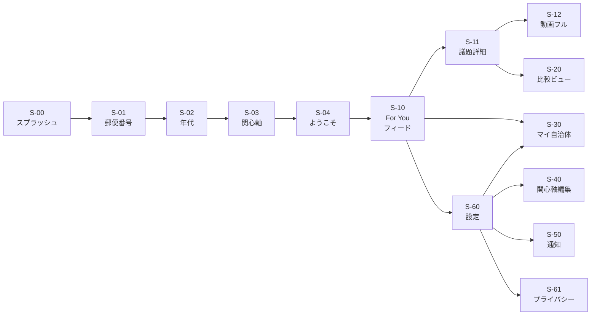

# UI_WIREFRAMES.md — UI ワイヤーフレーム設計書

> Citify のフロントエンド主要画面のワイヤーフレーム、デザインシステム、画面遷移を記述します。
>
> Coding Agent はフロントエンド実装時、必ず該当画面のワイヤーフレームと受け入れ条件を参照してください。

---

## 0. デザインシステム

### 0.1 デザイン原則

1. **3秒で価値が伝わる** — ホーム画面を開けば即 For You フィード
2. **TikTok の直感的操作** — 縦スクロール、タップで詳細、長押しでリアクション
3. **若者世代の感覚** — モバイル前提、最小限の文字密度
4. **政治的中立を視覚的にも担保** — トーンは情報的、扇動的ではない

### 0.2 カラーパレット

| 用途 | カラー | 備考 |
|---|---|---|
| Primary | `#2563EB` (シビックブルー) | アクセント |
| Background | `#0F172A` (ダークブルー) | 全体背景 (ダークテーマ基本) |
| Card | `#1E293B` | カード背景 |
| Text Primary | `#F8FAFC` | 本文 |
| Text Secondary | `#94A3B8` | 補足 |
| Success | `#10B981` | リアクション成功 |
| Tag Housing | `#F97316` | オレンジ |
| Tag Youth | `#A855F7` | 紫 |
| Tag Childcare | `#06B6D4` | シアン |
| (他タグも適宜) | | |

### 0.3 タイポグラフィ

- 日本語: Noto Sans JP
- 数字・英字: Inter
- 大見出し: 24px / Bold
- 議題タイトル: 18px / Bold
- 本文: 15px / Regular
- 補足: 13px / Regular

### 0.4 ベース技術

- **Framework**: Next.js 15 (App Router) + TypeScript
- **CSS**: Tailwind CSS
- **UI Library**: shadcn/ui
- **Icons**: lucide-react
- **アニメーション**: Framer Motion (縦スクロールのスナップ感)

### 0.5 タップターゲット

- 最小 44px × 44px
- 親指の届く下半分にメインアクション配置

---

## 1. 画面マップ

```
[起動]
   ↓
[サインイン (任意)]
   ↓
[オンボーディング (3 step)]
   ↓
[ホーム (For You フィード)] ←─────────────────┐
   ├─→ [議題詳細]                              │
   │     ├─→ [比較ビュー]                       │
   │     ├─→ [動画フル再生]                     │
   │     └─→ [リアクション送信]                  │
   ├─→ [マイ自治体管理]                         │
   ├─→ [関心軸編集]                            │
   ├─→ [通知設定]                              │
   └─→ [設定]                                  │
         └─→ [プロフィール / プライバシー]      │
```

---

## 2. 画面一覧

| ID | 画面名 | 役割 | 優先度 |
|---|---|---|---|
| S-00 | スプラッシュ・サインイン | 起動、認証 (匿名 or Google) | 🟥 |
| S-01 | オンボーディング 1: 郵便番号 | 居住地の選択 | 🟥 |
| S-02 | オンボーディング 2: 年代 | 年代の選択 | 🟥 |
| S-03 | オンボーディング 3: 関心軸 | 関心軸を複数選択 | 🟥 |
| S-04 | 「ようこそ」画面 | フィード初表示前のプレビュー | 🟦 |
| S-10 | **ホーム (For You フィード)** | TikTok型縦スクロール (最重要) | 🟥 |
| S-11 | **議題詳細** | 個別議題の深掘り | 🟥 |
| S-12 | 動画フル再生 | Veo 動画を全画面で再生 | 🟦 |
| S-20 | **比較ビュー** | 複数自治体の同テーマ比較 | 🟦 |
| S-30 | マイ自治体管理 | 5自治体まで登録 | 🟥 |
| S-40 | 関心軸編集 | 関心軸の追加・削除 | 🟦 |
| S-50 | 通知設定 | 週次配信のON/OFF | 🟦 |
| S-60 | 設定 | 各種設定 | 🟥 |
| S-61 | プロフィール / プライバシー | データ削除等 | 🟥 |
| S-70 | ペルソナ切替 | 「新社会人」「U ターン」等のプリセット | 🟩 |

---

## 3. 主要画面のワイヤーフレーム

### S-00: スプラッシュ・サインイン

```
┌─────────────────────────────────┐
│                                 │
│                                 │
│           🏛️ Citify              │
│                                 │
│   あなたの街、あなたの世代の話を、 │
│            60 秒で。              │
│                                 │
│                                 │
│   ┌─────────────────────────┐   │
│   │  Googleでサインイン       │   │
│   └─────────────────────────┘   │
│   ┌─────────────────────────┐   │
│   │  ゲストではじめる         │   │
│   └─────────────────────────┘   │
│                                 │
│   利用規約 | プライバシーポリシー  │
└─────────────────────────────────┘
```

### S-01: オンボーディング 1 — 郵便番号

```
┌─────────────────────────────────┐
│  ●○○                  スキップ → │
├─────────────────────────────────┤
│                                 │
│    どこに住んでいますか？        │
│                                 │
│    郵便番号を入力                │
│   ┌─────────────────────────┐   │
│   │ 154-0024               │   │
│   └─────────────────────────┘   │
│                                 │
│   ✓ 検出: 東京都世田谷区          │
│                                 │
│         [次へ] →                │
│                                 │
│   ※ 番地までは取得しません       │
└─────────────────────────────────┘
```

### S-02: オンボーディング 2 — 年代

```
┌─────────────────────────────────┐
│  ●●○                  スキップ → │
├─────────────────────────────────┤
│                                 │
│    あなたの年代は？              │
│                                 │
│   ┌─────────────────────────┐   │
│   │ 18-24歳               ○ │   │
│   └─────────────────────────┘   │
│   ┌─────────────────────────┐   │
│   │ 25-29歳               ● │   │
│   └─────────────────────────┘   │
│   ┌─────────────────────────┐   │
│   │ 30-34歳               ○ │   │
│   └─────────────────────────┘   │
│   ┌─────────────────────────┐   │
│   │ 35歳以上              ○ │   │
│   └─────────────────────────┘   │
│                                 │
│         [次へ] →                │
└─────────────────────────────────┘
```

### S-03: オンボーディング 3 — 関心軸

```
┌─────────────────────────────────┐
│  ●●●                            │
├─────────────────────────────────┤
│                                 │
│    気になるテーマを選ぼう         │
│    (複数選択可、3つ以上推奨)      │
│                                 │
│  ┌────────┐ ┌────────┐ ┌──────┐ │
│  │🏠住居 ✓│ │💼仕事 ✓│ │💍結婚│ │
│  └────────┘ └────────┘ └──────┘ │
│  ┌────────┐ ┌────────┐ ┌──────┐ │
│  │👶子育て│ │💴税金  │ │🚀起業│ │
│  └────────┘ └────────┘ └──────┘ │
│  ┌────────┐ ┌────────┐ ┌──────┐ │
│  │🌊防災 ✓│ │🏥医療  │ │📚教育│ │
│  └────────┘ └────────┘ └──────┘ │
│  ┌────────┐ ┌────────┐ ┌──────┐ │
│  │🏔️移住  │ │🌳環境  │ │🚃交通│ │
│  └────────┘ └────────┘ └──────┘ │
│  ┌────────┐ ┌────────┐ ┌──────┐ │
│  │👵高齢  │ │🎯若者  │ │🌈ジェン│ │
│  └────────┘ └────────┘ ┌──────┐ │
│                       │💻DX  │ │
│                       └──────┘ │
│         [はじめる] →             │
└─────────────────────────────────┘
```

---

### S-10: ホーム (For You フィード) — **最重要画面**

```
┌─────────────────────────────────┐
│  Citify         🔔   ⚙️           │
├─────────────────────────────────┤
│                                 │
│ ┏━━━━━━━━━━━━━━━━━━━━━━━━━━━━━━┓│
│ ┃                              ┃│
│ ┃   [Veo 60秒縦動画]           ┃│
│ ┃                              ┃│
│ ┃    抽象的なシーン             ┃│
│ ┃    例:家のシルエット         ┃│
│ ┃                              ┃│
│ ┃                              ┃│
│ ┃     ▶ 0:23 / 1:00            ┃│
│ ┃                              ┃│
│ ┃ ⚠ AI が説明用に作成した動画です ┃│
│ ┗━━━━━━━━━━━━━━━━━━━━━━━━━━━━━━┛│
│                                 │
│ #住居  #若者                     │
│ 📍 世田谷区  📅 2026/5/15        │
│                                 │
│ 【世田谷区、若者向け家賃補助を新設】│
│                                 │
│ • 22-29歳の単身者に月最大3万円。  │
│ • 区内民間賃貸、年収400万以下が   │
│   条件として議論中。              │
│ • 9月申請開始予定。               │
│                                 │
│ 💬 あなたの世代の 65% が「気になる」 │
│                                 │
│         ┌────────────┐          │
│   👍    │  気になる   │   👎 関係 │
│         │            │      なさそう │
│         └────────────┘          │
│                                 │
│   [詳しく見る →]   [比較する]    │
│                                 │
│            ↕ スワイプ            │
├─────────────────────────────────┤
│  🏠 ホーム  🔍 探す  📍 自治体  ⚙️ │
└─────────────────────────────────┘
```

**受け入れ条件 (FEATURES.md A-8)**:
- 上から優先度順に議題カードが並ぶ
- カードに Veo 動画（or Imagen サムネ）、タイトル、3行サマリ、自治体名、タグ表示
- 縦スワイプで次カード
- カード上半分のタップで動画フル再生 (S-12)
- カード下半分のタップで議題詳細 (S-11)
- 「気になる」「関係なさそう」のリアクションボタン

---

### S-11: 議題詳細

```
┌─────────────────────────────────┐
│  ← 戻る                          │
├─────────────────────────────────┤
│                                 │
│ ┏━━━━━━━━━━━━━━━━━━━━━━━━━━━━━━┓│
│ ┃   [Veo 動画 (縮小)]           ┃│
│ ┃   タップでフル再生 →          ┃│
│ ┗━━━━━━━━━━━━━━━━━━━━━━━━━━━━━━┛│
│                                 │
│ 【世田谷区、若者向け家賃補助を新設】│
│                                 │
│ 役所表記:                        │
│ 世田谷区若年単身世帯向け住宅費    │
│ 助成事業の創設について           │
│                                 │
│ ▼ AI による平易化サマリ          │
│ ┌─────────────────────────────┐ │
│ │ • 22-29歳の単身者に月最大     │ │
│ │   3万円の家賃補助が始まる。   │ │
│ │ • 対象は区内民間賃貸、        │ │
│ │   年収400万円以下が条件。     │ │
│ │ • 予算2億円、9月申請開始予定。 │ │
│ └─────────────────────────────┘ │
│                                 │
│ 📌 あなたへの関係                │
│ 22歳・世田谷区民のあなたには      │
│ 月3万円は大きい話。9月の申請開始  │
│ に注目しよう。                    │
│                                 │
│ 📖 用語解説                      │
│ • 本会議: 区議会の正式な会議      │
│ • 条例: 自治体のルール           │
│                                 │
│ ▼ 関連する議事録発言 (RAG)       │
│ ┌─────────────────────────────┐ │
│ │ 「若年層の流出を食い止める     │ │
│ │  ため、家賃補助の創設を…」    │ │
│ │ — ○○区議 (令和8年5月15日)     │ │
│ └─────────────────────────────┘ │
│ ┌─────────────────────────────┐ │
│ │ 「予算規模は…」              │ │
│ └─────────────────────────────┘ │
│                                 │
│ 📎 原典 (議事録)                 │
│ → 世田谷区議会 令和8年5月15日   │
│   定例会 [外部リンク]            │
│                                 │
│ 💬 集計値                        │
│ あなたの世代の反応 (165人)       │
│ ┌────────────────────────────┐  │
│ │ 気になる    ████░░░ 65%     │  │
│ │ 関係なさそう ██░░░░░ 35%    │  │
│ └────────────────────────────┘  │
│                                 │
│   [👍 気になる]  [👎 関係なさそう]│
│                                 │
│   [⚖️ 隣の区と比較する]           │
│                                 │
│ ⓘ 本コンテンツは AI が議事録を    │
│   もとに作成した解説です。       │
│   正確な内容は原典をご確認ください。│
│                                 │
└─────────────────────────────────┘
```

**受け入れ条件 (FEATURES.md A-9)**:
- 平易化タイトル + 役所表記両方
- 議事録 RAG 検索結果を3件
- 原典 URL リンク必須
- リアクションボタン
- 動画再生プレイヤー
- AI生成ディスクレーマー必須

---

### S-12: 動画フル再生

```
┌─────────────────────────────────┐
│  ×                          ⓘ   │
│                                 │
│ ┌─────────────────────────────┐ │
│ │                             │ │
│ │                             │ │
│ │                             │ │
│ │       [Veo 60秒]             │ │
│ │       全画面再生 (9:16)       │ │
│ │                             │ │
│ │                             │ │
│ │                             │ │
│ │                             │ │
│ └─────────────────────────────┘ │
│                                 │
│ ⚠ AI が説明用に作成した動画です  │
│                                 │
│ ━━━━━━━━━━━━━━━━━━━━ 0:24/1:00 │
│                                 │
│  ⏯  [再生/停止]   🔊            │
│                                 │
└─────────────────────────────────┘
```

---

### S-20: 比較ビュー — 差別化の核

```
┌─────────────────────────────────┐
│  ← 戻る   比較ビュー             │
├─────────────────────────────────┤
│                                 │
│  テーマ: 子育て支援              │
│                                 │
│  自治体を選択 (最大3つ)          │
│  ┌──────────┐ ┌──────────┐      │
│  │世田谷区 ✓ │ │渋谷区 ✓ │      │
│  └──────────┘ └──────────┘      │
│  ┌──────────┐                   │
│  │+ 追加    │                    │
│  └──────────┘                   │
│                                 │
│ ┌─────────────┬────────────────┐│
│ │  項目       │ 世田谷 │ 渋谷 ││
│ ├─────────────┼────────┼───────┤│
│ │ 児童手当    │月1.5万 │月1.5万││
│ │  追加上乗せ │+0.5万  │ なし  ││
│ ├─────────────┼────────┼───────┤│
│ │ 保育料無償化│完全無償 │所得制限││
│ ├─────────────┼────────┼───────┤│
│ │ 待機児童    │ 12人   │ 0人   ││
│ ├─────────────┼────────┼───────┤│
│ │ 子ども医療  │中学卒  │高校卒 ││
│ ├─────────────┼────────┼───────┤│
│ │ 学童保育    │週5日   │週6日  ││
│ └─────────────┴────────┴───────┘│
│                                 │
│ 📋 中立的な観察                  │
│ 渋谷区は待機児童ゼロですが、保育料 │
│ 無償化には所得制限があります。    │
│ 世田谷区は無償化が完全ですが、    │
│ 待機児童が一部残っています。      │
│                                 │
│ 📎 出典                          │
│ • 世田谷区議会令和8年5月15日 →    │
│ • 渋谷区議会令和8年5月12日 →     │
│                                 │
└─────────────────────────────────┘
```

**受け入れ条件 (FEATURES.md B-2)**:
- マイ自治体から 2-3 つ選択
- 同テーマで横並び比較
- 差分のハイライト表示
- 必ず出典 URL リンク
- 「中立的な観察」のみ AI 出力、評価コメントなし

---

### S-30: マイ自治体管理

```
┌─────────────────────────────────┐
│  ← 戻る   マイ自治体              │
├─────────────────────────────────┤
│                                 │
│  登録中の自治体 (3/5)            │
│                                 │
│  ★ メイン自治体                 │
│  ┌─────────────────────────────┐│
│  │ 🏠 東京都 世田谷区           ││
│  │   (現住所)              ⋮   ││
│  └─────────────────────────────┘│
│                                 │
│  サブ自治体                     │
│  ┌─────────────────────────────┐│
│  │ 🏠 大阪府 大阪市             ││
│  │   (実家)               ⋮ ✕  ││
│  └─────────────────────────────┘│
│  ┌─────────────────────────────┐│
│  │ 🏠 長野県 軽井沢町           ││
│  │   (移住候補)           ⋮ ✕  ││
│  └─────────────────────────────┘│
│                                 │
│  ┌─────────────────────────────┐│
│  │ + 自治体を追加               ││
│  └─────────────────────────────┘│
│                                 │
└─────────────────────────────────┘
```

---

### S-40: 関心軸編集

```
┌─────────────────────────────────┐
│  ← 戻る   関心軸                 │
├─────────────────────────────────┤
│                                 │
│  気になるテーマ (現在 5 個)       │
│  ✓ がついているものがフィードに  │
│  優先表示されます。              │
│                                 │
│  ┌────────┐ ┌────────┐ ┌──────┐ │
│  │🏠住居 ✓│ │💼仕事 ✓│ │💍結婚│ │
│  └────────┘ └────────┘ └──────┘ │
│  ┌────────┐ ┌────────┐ ┌──────┐ │
│  │👶子育て│ │💴税金  │ │🚀起業✓│ │
│  └────────┘ └────────┘ └──────┘ │
│  ┌────────┐ ┌────────┐ ┌──────┐ │
│  │🌊防災 ✓│ │🏥医療  │ │📚教育│ │
│  └────────┘ └────────┘ └──────┘ │
│  ┌────────┐ ┌────────┐ ┌──────┐ │
│  │🏔️移住 ✓│ │🌳環境  │ │🚃交通│ │
│  └────────┘ └────────┘ └──────┘ │
│  ...                            │
│                                 │
│  💡 ペルソナで一括設定 →         │
│                                 │
│         [保存]                  │
└─────────────────────────────────┘
```

---

### S-50: 通知設定

```
┌─────────────────────────────────┐
│  ← 戻る   通知                   │
├─────────────────────────────────┤
│                                 │
│  週次まとめ                      │
│  ┌─────────────────────────────┐│
│  │ 週次まとめを受け取る  [ON ]  ││
│  └─────────────────────────────┘│
│                                 │
│  配信タイミング                  │
│  曜日: [月曜 ▼]                  │
│  時刻: [09:00 ▼]                 │
│                                 │
│  配信方法                        │
│  ☑ メール (xxx@example.com)      │
│  ☑ アプリ内通知                  │
│  ☐ Push 通知 (Web)               │
│                                 │
│  ───────                        │
│                                 │
│  リアルタイム通知                │
│  ☐ 自分の街の重要議題があったら   │
│  ☐ 比較中の自治体に動きがあったら │
│                                 │
│         [保存]                  │
└─────────────────────────────────┘
```

---

### S-60: 設定

```
┌─────────────────────────────────┐
│  ← 戻る   設定                   │
├─────────────────────────────────┤
│                                 │
│  👤 プロフィール             →   │
│  🏠 マイ自治体               →   │
│  🎯 関心軸                  →   │
│  🔔 通知設定                 →   │
│  🎭 ペルソナ切替             →   │
│  ───────────                    │
│  🔒 プライバシー / データ      →   │
│  ⓘ ご利用ガイド              →   │
│  ⚖️ 利用規約                  →   │
│  📋 プライバシーポリシー       →   │
│  ───────────                    │
│  🚪 サインアウト                  │
│                                 │
│  ───────                        │
│  Citify v0.1.0                  │
│  © 2026 Yuji Matsumoto          │
└─────────────────────────────────┘
```

---

### S-61: プライバシー・データ

```
┌─────────────────────────────────┐
│  ← 戻る   プライバシー           │
├─────────────────────────────────┤
│                                 │
│  あなたのデータの扱い            │
│                                 │
│  ✓ 住所は郵便番号レベルのみ保存  │
│  ✓ リアクションは集計後匿名化    │
│  ✓ データは日本リージョンに保管  │
│  ✓ 第三者への提供なし            │
│                                 │
│  ◾ 統計値                       │
│  記録した自治体: 3 個            │
│  リアクション数: 47 件            │
│  ───────                        │
│                                 │
│  ◾ データ操作                   │
│  [自分のデータをダウンロード]    │
│                                 │
│  [リアクション履歴を削除]        │
│                                 │
│  [アカウントを完全削除] ⚠️       │
│                                 │
│  ───────                        │
│                                 │
│  ◾ AI 生成コンテンツについて     │
│  Citifyの議事録要約・解説・動画は │
│  すべて AI による解釈です。      │
│  正確な内容は議事録の原典をご    │
│  確認ください。                  │
│                                 │
└─────────────────────────────────┘
```

---

## 4. 画面遷移図



---

## 5. PWA 設定

```json
// apps/web/public/manifest.json
{
  "name": "Citify",
  "short_name": "Citify",
  "description": "自治体情報の For You フィード",
  "start_url": "/",
  "display": "standalone",
  "orientation": "portrait",
  "background_color": "#0F172A",
  "theme_color": "#2563EB",
  "icons": [
    {"src": "/icons/icon-192.png", "sizes": "192x192", "type": "image/png"},
    {"src": "/icons/icon-512.png", "sizes": "512x512", "type": "image/png"}
  ]
}
```

---

## 6. レスポンシブ対応

| ブレークポイント | レイアウト |
|---|---|
| 〜640px (モバイル) | フル幅、下部ナビ、縦スクロール |
| 641-1024px (タブレット) | 中央寄せ、サイドナビ |
| 1025px〜 (PC) | 中央寄せの一画面アプリ風 (TikTok PC版に近い) |

**ハッカソンデモはモバイル画面想定** で実装。PC でも縦画面のまま中央表示。

---

## 7. アクセシビリティ

- すべての操作にキーボード対応
- 動画・画像に alt テキスト
- 色だけに頼らないアイコン
- フォントサイズ拡大対応 (1.5x まで)
- WCAG AA 準拠目指す (時間あれば AAA)

---

## 8. Next.js 実装方針 (リファレンス)

### 8.1 ディレクトリ構造

```
apps/web/src/
├── app/
│   ├── layout.tsx                # Root (PWA manifest, Service Worker)
│   ├── page.tsx                  # / → サインインまたはホームへ
│   ├── (auth)/
│   │   ├── sign-in/page.tsx      # S-00
│   ├── (onboarding)/
│   │   ├── postal/page.tsx       # S-01
│   │   ├── age/page.tsx          # S-02
│   │   └── interests/page.tsx    # S-03
│   ├── home/page.tsx             # S-10 (For You)
│   ├── topics/[topicId]/page.tsx # S-11
│   ├── compare/page.tsx          # S-20
│   ├── municipalities/page.tsx   # S-30
│   ├── interests/page.tsx        # S-40
│   ├── notifications/page.tsx    # S-50
│   ├── settings/
│   │   ├── page.tsx              # S-60
│   │   └── privacy/page.tsx      # S-61
├── components/
│   ├── feed/
│   │   ├── FeedCard.tsx          # S-10 のカード
│   │   ├── VeoPlayer.tsx
│   │   └── ReactionButtons.tsx
│   ├── topic/
│   │   ├── SummaryView.tsx
│   │   ├── GlossaryView.tsx
│   │   └── RagResults.tsx
│   ├── compare/
│   │   └── ComparisonTable.tsx
│   ├── ui/                       # shadcn/ui ベース
│   └── common/
│       ├── Header.tsx
│       └── BottomNav.tsx
├── lib/
│   ├── firebase.ts
│   ├── api-client.ts
│   └── types.ts
└── hooks/
```

### 8.2 主要コンポーネントスケッチ

```typescript
// components/feed/FeedCard.tsx
export function FeedCard({ topic }: { topic: TopicDoc }) {
  return (
    <article className="snap-start h-screen flex flex-col">
      <VeoPlayer src={topic.media?.veoSignedUrl} fallbackImage={topic.media?.imagenSignedUrl} />
      <div className="px-4 py-3 bg-slate-900">
        <TagChips tags={topic.tags} />
        <MunicipalityChip code={topic.municipalityCode} />
        <h2 className="text-lg font-bold mt-2">{topic.title}</h2>
        <SummaryThreeLines summary={topic.translated.summary} />
        <ReactionWidget topicId={topic.topicId} />
        <Link href={`/topics/${topic.topicId}`}>詳しく見る →</Link>
      </div>
    </article>
  );
}

// app/home/page.tsx
export default async function Home() {
  const user = await getCurrentUser();
  const feed = await fetchUserFeed(user.uid);

  return (
    <main className="snap-y snap-mandatory h-screen overflow-y-scroll">
      {feed.map((item) => (
        <FeedCard key={item.topicId} topic={item.topic} />
      ))}
    </main>
  );
}
```

---

## 9. デモシナリオの画面動線

ピッチ動画 (2-3分) で見せる動線：

```
00:00-00:15  S-00 → S-01 → S-02 → S-03 (オンボーディング)
00:15-00:45  S-10 (For You フィード、3-4議題を縦スクロール)
00:45-01:15  S-11 (議題詳細、翻訳サマリ、RAG結果)
01:15-01:45  S-20 (比較ビュー、世田谷 vs 渋谷)
01:45-02:00  S-30 (マイ自治体 — 実家・移住候補)
02:00-02:30  (バックエンド画面 — エージェント可視化)
02:30-03:00  (DevOps画面 — Terraform, CI/CD, Cloud Run)
```

---

## 10. 改訂履歴

- 2026-05-19 v0.1 初版作成
